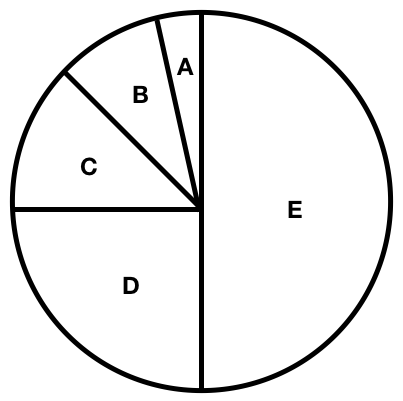
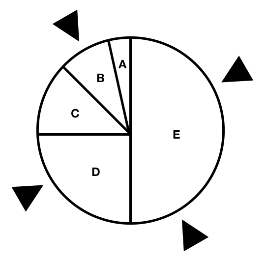
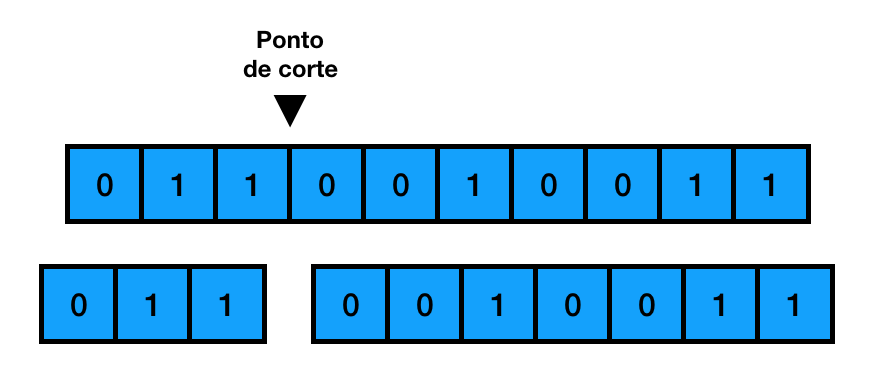
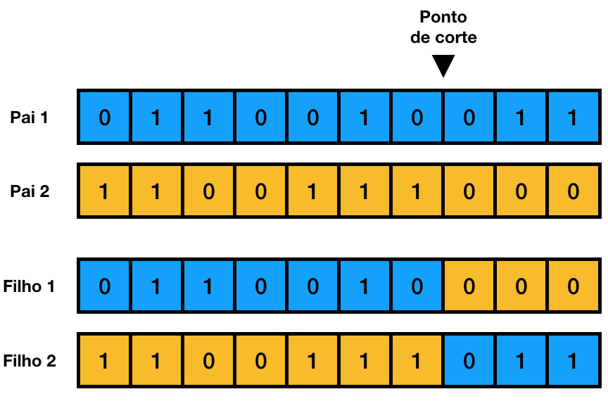
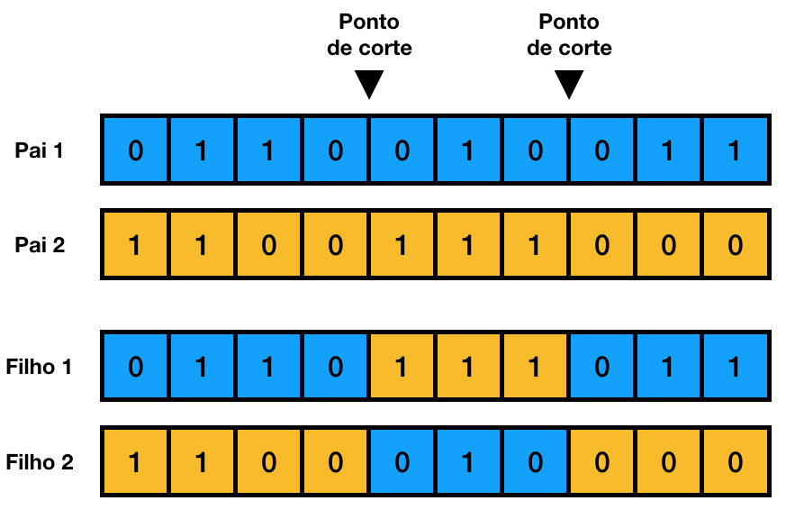
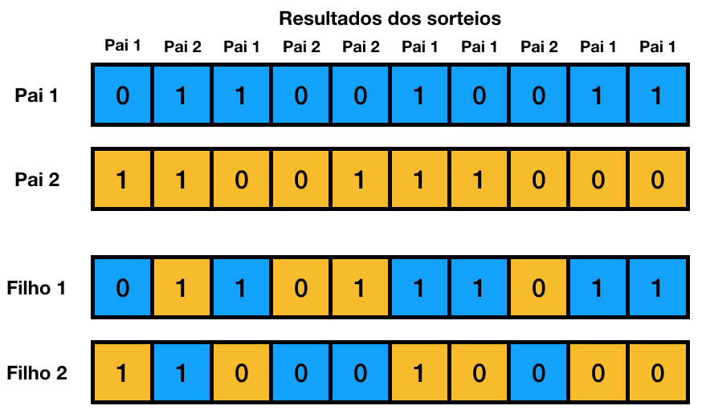
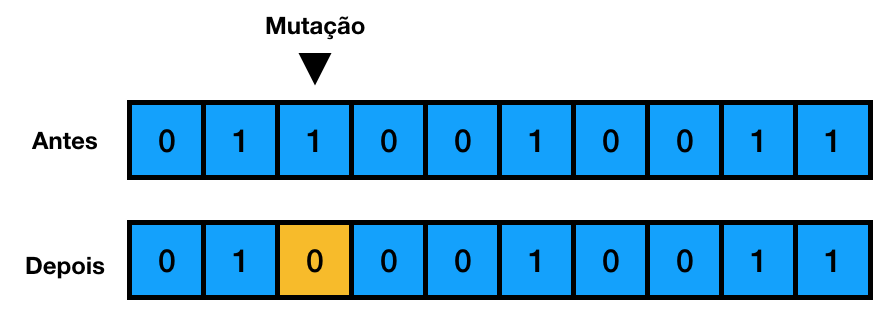

% Notas de Aula - Inteligência Artificial
% Yuri Malheiros
% UFPB - Campus IV - Rio Tinto

# Algoritmos genéticos

## 1. Introdução

Algoritmos genéticos (AGs) é uma técnica inspirada na teoria da evolução de
Charles Darwin, na qual soluções para um problema evoluem através de
procedimentos baseados na seleção natural e na genética. Tais problemas podem
ser entendidos como uma busca num espaço de possíveis soluções, sendo os AGs
especialmente úteis quando esse espaço é muito grande e complexo.

O AG inicia criando uma população de possíveis soluções aleatoriamente para um
problema, cada solução é chamada de indivíduo. Os indivíduos são avaliados por
uma função de fitness que indica a qualidade de cada um deles. Em seguida, os
indivíduos com os melhores valores de fitness são selecionados para criar uma
nova geração de indivíduos através do processo de reprodução. Assim, é esperado
que a nova geração seja melhor que a anterior. O processo de seleção dos
melhores indivíduos e criação de uma nova geração é repetido várias vezes até
que seja determinada a parada do algoritmo.

## 2. Visão geral do algoritmo

<!-- Código em alto nível do algoritmo -->
Os passos do algoritmo explicados anteriormente podem ser codificados assim:

~~~{#mycode .numberLines startFrom=""}
inicializar(P)

while (condição de parada) do
    avaliar(P)
    melhores := selecionar(P)
    reproduzir(melhores)
~~~

Onde: 

  - P é a população de indivíduos
  - avaliar(P) aplica a função de fitness a todos os indivíduos
  - selecionar(P) seleciona os melhores indivíduos de acordo com o fitness
  - reproduzir(melhores) cria uma nova geração P a partir dos melhores indivíduos

Nas próximas seções veremos em detalhes diversos conceitos relacionados a cada
um dos passos do algoritmo, por exemplo, como representar um indivíduo, como
especificar uma função de fitness e como gerar novos indivíduos.

## 3. Codificação de um indivíduo

Uma das primeiras decisões que precisam ser tomadas para utilização de um AG é
como um indivíduo (solução do problema) será codificado. Nos AGs, cada solução é
representada por uma sequência de genes que formam o cromossomo do indivíduo. Na prática,
isso significa que o indivíduo precisa ser codificado numa estrutura de dados
que possa ser dividida em partes menores. Portanto, uma das formas mais comuns de
representação de um indivíduo em AGs é através de um array de bits, onde cada
gene é representado por 0 ou 1 e o conjunto de bits é o cromossomo do
indivíduo.

Por exemplo, dado o seguinte problema: tem-se um conjunto de cartas de baralho
que possuem valores de 1 até 13, encontre uma combinação de cartas que a soma
dos seus valores chegue o mais próximo de 21.  A solução do problema é um
conjunto de cartas. Com isso, podemos codificar o indivíduo usando um array com 13
bits. O bit 1 numa determinada posição significa que a carta com o valor da
posição foi escolhida, o bit 0 significa que a carta não foi escolhida. Por
exemplo, o array `[1, 0, 1, 0, 0, 0, 0, 0, 1, 0, 0, 0, 0]` representa que as
cartas 1, 3 e 9 foram escolhidas. Já o array `[0, 1, 1, 1, 0, 0, 0, 0, 0, 0, 0,
0, 1]` representa que as cartas 2, 3, 4 e 13 foram escolhidas.

## 4. Função de fitness

A função de fitness mede a qualidade de um indivíduo, ou seja, ela serve para
descobrirmos quais as melhores soluções encontradas. A definição da função de
fitness é crucial para o desempenho do AG, pois ela guia o algoritmo na procura
de uma solução para um problema. Se a função de fitness não for adequada,
podemos não encontrar as soluções desejadas.

Biologicamente, a função de fitness determina os indivíduos mais bem adaptados,
que consequentemente se reproduzem mais, passando os seus genes para gerações
posteriores.  Então, nos AGs, quanto maior o fitness de um indivíduo, mais
chances ele tem de ser escolhido para reprodução.

A função de fitness depende do problema que está sendo resolvido. Dessa forma,
cada problema pode trazer uma função diferente, que deve ser moldada de acordo
com as exigências especificadas.  Para problemas de maximização, por exemplo,
um problema com o objetivo de aumentar as vendas de uma empresa, a função de
fitness é um mapeamento direto, ou seja, quanto maior as vendas, maior o
fitness.  Por outro lado, em problemas de minimização, por exemplo, um problema
com o objetivo de diminuir os custos de uma empresa, não podemos usar essa
ideia diretamente, pois, nesse caso, quanto menor os custos, melhor. Como nos
AGs, quanto maior o fitness melhor a solução, usaremos uma função $f(x)$ que
calcula os custos da empresa para gerar a seguinte função de fitness:

$$fitness(x) = \frac{1}{1+f(x)}$$

Note que quanto menor o valor de $f(x)$, maior o valor do fitness, o que
garante a lógica de que quanto maior o fitness de uma solução, melhor ela é.

## 5. Seleção

A seleção é a etapa de escolha de indivíduos que vão gerar filhos para uma nova
geração. Nela, quanto maior o fitness de um indivíduo, maior a chance dele ser escolhido para se
reproduzir. Assim, espera-se que as novas gerações sejam melhores que as gerações anteriores.

Diversos métodos de seleção tem sido propostos. A seguir veremos os métodos da
roleta, amostragem estocástica universal e torneio. Para as explicações,
utilizaremos os 5 indivíduos mostrados na Tabela 1.

Table: Indivíduos e seus valores de fitness

| Indivíduo | Fitness |
|:---------:|:-------:|
| A         | 1       |
| B         | 2       |
| C         | 3       |
| D         | 6       |
| E         | 12      |

### 5.1 Método da roleta

Nesse método, cada indivíduo representa uma fatia de uma roleta, mas
diferentemente de uma roleta comum, as fatias variam de tamanho, sendo o
tamanho proporcional ao fitness do indivíduo.  Dessa forma, quanto maior o
fitness do indivíduo, maior a fatia dele na roleta.  A roleta para os
indivíduos da Tabela 1 é mostrada na Figura 1.

{ width=40% }

Para escolher um indivíduo que vai gerar um filho, basta rodar a roleta e
verificar que indivíduo foi selecionado.  Na prática, rodar a roleta é gerar um
número aleatório. Nesse exemplo, gera-se um número entre 0 e 24 (sem incluir o
24).  O valor 24 é obtido somando os valores de todos os fitness dos
indivíduos.  Assim, cada indivíduo vai representar um intervalo de números.
Para o exemplo, os intervalos estão na Tabela 2.

Table: Indivíduos, seus valores de fitness e os seus intervalos

| Id   | Fitness | Intervalo |
|:----:|:-------:|:----------:
| A    | 1       | \[0, 1\)  |
| B    | 2       | \[1, 3\)  |
| C    | 3       | \[3, 6\)  |
| D    | 6       | \[6, 12\) |
| E    | 12      | \[12, 24\)|

Com os intervalos determinados, após gerar o número aleatório, basta verificar
a que intervalo o número pertence e assim escolher o indivíduo.

### 5.2 Amostragem estocástica universal

No método da roleta, espera-se que cada indivíduo seja selecionado um número de
vezes proporcional ao seu fitness. Utilizando os dados da Tabela 1, é esperado
que o indivíduo E, por exemplo, seja escolhido em 50% dos casos, pois
$\frac{12}{24} = 0,5$. Já o indivíduo C, seria escolhido em 12,5% dos casos,
pois $\frac{3}{24} = 0,125$. Entretanto, como o método de seleção costuma ser
utilizado para escolher um número pequeno de indivíduos, a quantidade de vezes
que os indivíduos são escolhidos pode ficar bem distante da expectativa.

O método da amostragem estocástica universal surgiu para minimizar esse
problema. Nele, ao invés de rodar a roleta N vezes para escolher N indivíduos,
a roleta é girada apenas 1 vez com N apontadores que são usados para escolher
os indivíduos.  Esses apontadores devem possuir as mesmas distâncias entre
eles.

Na Figura 2 temos um exemplo de uma roleta com 4 apontadores. Rodando uma vez
essa roleta podemos selecionar 4 indivíduos, nesse caso, temos os indivíduos B e
D escolhidos uma vez e o E escolhido duas vezes.

{ width=50% }

Para implementação desse método, o primeiro passo é saber a distância entre os
apontadores. Para isso, divide-se a soma de todos os valores de fitness pelo
número de apontadores:

$$d = \frac{\sum_{i=1}^{n} (fitness(x^{(i)}))}{N}$$

Onde $x^{(i)}$ é o i-ésimo indivíduo, $n$ é a quantidade de indivíduos, $N$ é a
quantidade de apontadores e $fitness$ é a função que calcula o fitness de um
indivíduo.

Para o nosso exemplo com quatro apontadores, $d = \frac{24}{4} = 6$. Com isso,
escolhemos aleatoriamente o primeiro apontador que estará no intervalo \[0,
6\). Os apontadores restantes são calculados somando o valor de $d$ ao número
aleatório gerado.  Por exemplo, se o número escolhido para o primeiro apontador
for 2, o segundo apontador terá o valor $2+6=8$, o terceiro apontador terá o
valor $8+6=14$ e o quarto apontador terá o valor $14+6=20$.

### 5.3 Torneio

No método do torneio, $k$ indivíduos são escolhidos aleatoriamente entre todos
os indivíduos para competir em um torneio, no qual o vencedor é o indivíduo
selecionado.  Para determinar o vencedor, basta comparar todos os valores de
fitness e escolher o indivíduo que possuir o maior.

O valor de $k$ influencia no favorecimento de indivíduos com alto valor de
fitness durante a seleção. Se o valor de $k$ for alto, indivíduos mais fracos
terão poucas chances de ser selecionados, pois com frequência eles disputarão o
torneio com indivíduos mais fortes.  Isto pode resultar numa convergência
prematura do algoritmo, fazendo com que seja encontrada uma solução subótima
(máximo local).  Por outro lado, se o valor de $k$ for muito baixo, o algoritmo
pode demorar muito tempo para convergir.

É possível utilizar probabilidades para aumentar a variabilidade na escolha dos
indivíduos num torneio.  Para isso, define-se uma constante $p$ que representa
a probabilidade de, em um torneio, o indivíduo com maior fitness ser escolhido.
O indivíduo com segundo maior fitness deve ser escolhido com probabilidade
$p(1-p)$. O terceiro maior deve ser escolhido com probabilidade $p(1-p)^2$, o
quarto com probabilidade $p(1-p)^3$ e assim por diante.

### 5.4 Elitismo

Durante o processo de evolução dos indivíduos espera-se que as gerações futuras
tenham no geral indivíduos melhores que as gerações anteriores.  Entretanto,
por causa dos diversos fatores estocásticos dos AGs, é possível que indivíduos
bons sejam descartados ou que não consigam passar seus genes para gerações
posteriores.

O elitismo é uma técnica que mantém alguns dos melhores indivíduos de uma
geração e os passa sem modificações para a geração futura, assim garantindo que
boas soluções não sejam perdidas. O elitismo é comumente usado com outras
técnicas de seleção, dessa forma, o processo de evolução continua como
esperado, mas o algoritmo assegura que algumas soluções da geração futura são
pelo menos tão boas quanto as da geração anterior.

## 6. Crossover

Para gerar um novo indivíduo é necessário recombinar a informação genética dos
seus pais. Esse processo é realizado através da operação de crossover. Nas
subseções a seguir são apresentados três métodos diferentes de crossover:
crossover de 1 ponto, crossover de 2 pontos e crossover uniforme.

### 6.1 Crossover de 1 ponto

Dado um indivíduo representado por uma sequência de genes, podemos dividi-la
em duas através de um ponto de corte entre dois genes.  Por exemplo,
na Figura 3 tem-se um indivíduo sendo dividido através de um ponto de corte
entre o terceiro e quarto gene.

{ width=75% }

No crossover de 1 ponto, é escolhido simultaneamente de forma aleatória um
ponto de corte para os dois pais.  Com isso, é possível gerar dois filhos da
seguinte maneira.  O primeiro filho tem os genes do primeiro pai até o ponto de
corte e os genes do segundo pai após o ponto de corte. O segundo filho segue o
oposto, ele tem os genes do segundo pai até o ponto de corte e os genes do
primeiro pai após o ponto de corte.  A Figura 4 ilustra esse processo.

{ width=75% }

### 6.2 Crossover de 2 pontos

O crossover de 2 pontos usa a mesma ideia do crossover de 1 ponto, mas, nesse
caso, escolhe-se dois pontos de cortes aleatoriamente, ao invés de um.  O
primeiro filho tem os genes do primeiro pai do início até o primeiro ponto de
corte. Ele tem os genes do segundo pai do primeiro ponto de corte até o segundo
ponto de corte. E, por fim, ele tem os genes do primeiro pai novamente do
segundo ponto de corte até o final.  O segundo filho segue a ordem contrária.
Ele começa com os genes do segundo pai, após o primeiro ponto de corte muda
para os genes do primeiro pai e após o segundo ponto de corte ele volta a ter
os genes do segundo pai. A Figura 5 ilustra o crossover de 2 pontos.

{ width=75% }

### 6.3 Crossover uniforme 

Podemos estender o crossover para que ele tenha mais de dois pontos, fazendo
com que a mistura entre os genes dos pais seja ainda maior.  Levando essa
abordagem ao extremo, temos o crossover uniforme. Nele, para cada gene é feito
um sorteio, tendo o filho 50% de chances de ter o gene do primeiro pai e 50% de
chances de ter o gene do segundo pai.  Nesse método também é possível gerar
dois filhos de uma só vez, basta que o segundo filho receba o gene do pai
oposto ao sorteado para o primeiro filho. Por exemplo, se para o primeiro gene
do primeiro filho for sorteado o primeiro pai, então o segundo filho recebe o
gene do segundo pai.

A Figura 6 ilustra o crossover uniforme. Nela podemos ver que para o primeiro
gene for sorteado o pai 1, assim o filho 1 recebe o gene do pai 1 e o filho 2
recebe o do pai 2.  Para o segundo gene foi sorteado o pai 2, logo temos que o
filho 1 recebe o gene do pai 2 e o filho 2 recebe o gene do pai 1.  O processo
continua para os genes restantes, sendo as definições dos genes realizadas de
acordo com o resultado do sorteio.

{ width=75% }

## 7. Mutação

Através da seleção e crossover, os AGs evoluem soluções que tendem a melhorar a
cada geração. Entretanto, em alguns casos, as soluções podem convergir para um
mínimo local. Com isso, tem-se indivíduos muito parecidos com um valor de
fitness que ainda poderia ser melhorado, mas como não existe grande variação
genética, então as futuras gerações são parecidas com as gerações anteriores.
A mutação tem como objetivo criar mudanças inesperadas num indivíduo para
prevenir que o algoritmo fique preso a um máximo local.

Na mutação, cada gene de um indivíduo tem uma probabilidade pequena, por
exemplo, 0,1%, de ter o seu valor alterado.  Se o indivíduo for codificado
através de uma sequência de 0s e 1s, a alteração feita pela mutação em um gene
é trocar o valor 0 por 1 ou valor 1 por 0. A Figura 7 mostra um indivíduo que
sofreu mutação no seu terceiro gene.

{ width=75% }

## 8. Exemplo

O problema da mochila (knapsack problem) é um problema clássico da computação,
ele é descrito da seguinte forma.  Dado um conjunto de objetos, cada um com um
peso e um valor, quais objetos colocar numa mochila, que tem um limite de peso
suportável, para que a soma dos valores dos objetos seja a maior possível.

Para resolver este problema utilizando algoritmos genéticos, primeiramente
definimos como será codificado um indivíduo. Dado que temos N objetos que podem
ser colocados na mochila, o indivíduo pode ser codificado através de um vetor
de N posições, cada uma delas representando um objeto. O número 1 numa posição
do vetor representa que aquele objeto vai ser colocado dentro da mochila.  O
número 0 numa posição do vetor representa que aquele objeto não vai ser
colocado na mochila.  Por exemplo, com 5 objetos, podemos ter um indivíduo
11001, nesse caso, o primeiro, segundo e quinto objetos vão ser colocados na
mochila, e o terceiro e o quarto objetos não serão colocados.

A função de fitness para esse problema é simplesmente a soma dos valores dos
objetos escolhidos.  Quanto maior o valor, melhor a solução, logo maior o
fitness.  Entretanto, o peso dos objetos não pode ultrapassar o limite
suportado pela mochila, assim algumas soluções podem ser inválidas.

Por exemplo, dados os objetos da Tabela 3, se a mochila tiver o peso limite
igual a 15, então o indivíduo 11001 é inválido, pois o peso total é
$5+5+10=20$.

Table: Objetos para o problema da mochila.

| Objeto |  Valor  |  Peso  |
|:------:|:-------:|:------:|
| 1      | 2       | 5      |
| 2      | 3       | 5      |
| 3      | 5       | 4      |
| 4      | 3       | 3      | 
| 5      | 7       | 10     |

Quando isso acontecer podemos reparar o indivíduo através da remoção de alguns
objetos até que o peso seja adequado.  Uma estratégia boa para isso é remover
os objetos que tenham as menores razões valor/peso. Outra abordagem para
resolver o problema dos indivíduos inválidos é adicionar à função de fitness
uma penalização se o peso ultrapassar o limite da mochila.  Por exemplo, o
fitness pode ser calculado assim:

$$fitness(x) = \sum_{i=1}^{n}v_i - \alpha \times max(0, \sum_{i=1}^{n}w_i - l)$$

Onde, $v_i$ é o valor do i-ésimo objeto escolhido para ser colocado dentro da
mochila, $w_i$ é o peso do i-ésimo objeto escolhido, $l$ é o limite de peso da
mochila e $\alpha$ é uma constante que regula a intensidade da penalização.

Assim, se o peso dos objetos for maior que o da mochila é subtraído o valor
$\alpha \times \sum_{i=1}^{n}w_i - l$, tornando o fitness do indivíduo menor.
Se o peso dos objetos não ultrapassar o limite, o fitness é calculado
normalmente apenas somando os valores dos objetos.

Nesse problema, para seleção, crossover e mutação, pode-se utilizar quaisquer  métodos
apresentados anteriormente.

Finalizadas essas definições, o AG pode ser executado para evoluir os indivíduos por
várias gerações. Ao final da execução, teremos um conjunto de soluções especificando
quais objetos colocar na mochila para que a soma dos valores seja o maior
possível.

## Referências

- Livro: Artificial Intelligence a Modern Approach (3a edição). Russel, S. e Norvig, P.
- Livro: An Introduction to Genetic Algorithms. Mitchell, M.
- Slides da disciplina: Metaheurísticas da UFRN (aulas 7 e 9 sobre algoritmos genéticos). Lacerda, E. G. M. URL: https://www.dca.ufrn.br/~estefane/metaheuristicas
