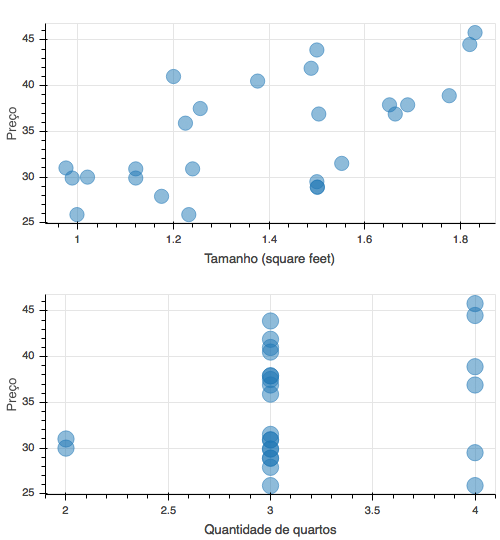
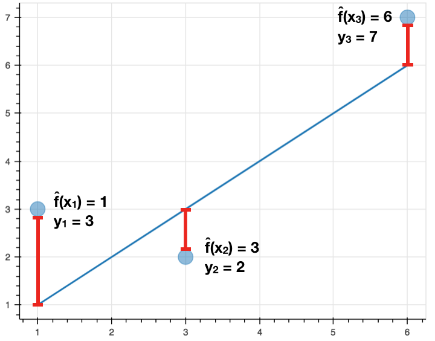
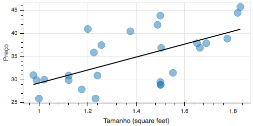
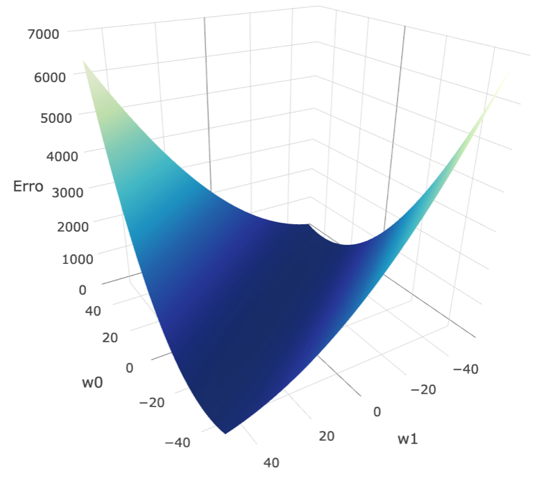
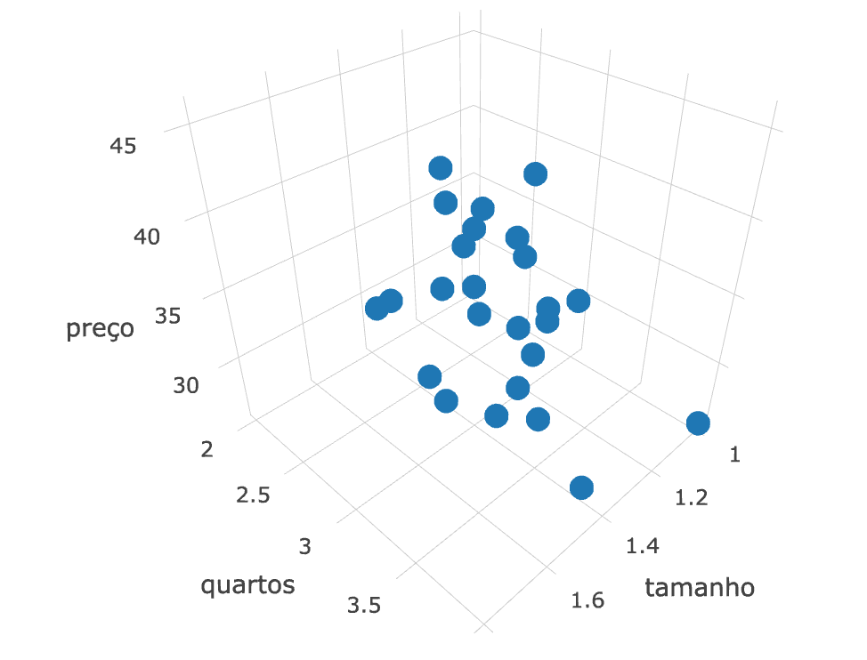
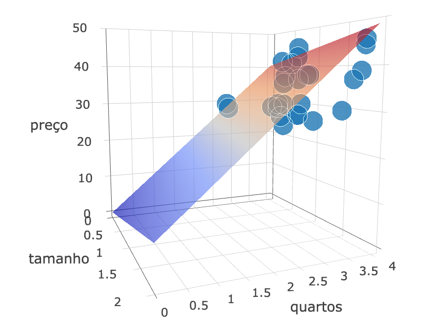

% Notas de Aula - Inteligência Artificial
% Yuri Malheiros
% UFPB - Campus IV - Rio Tinto

# Aprendizagem de máquina - Primeiros passos e regressões

## 1. Introdução

<!--computadores aprenderem através da experiência-->
A **aprendizagem de máquina** é uma área da inteligência artificial que tem como
objetivo a criação de programas que aprendem. Em outras palavras, são
desenvolvidos programas que melhoram seu desempenho, de acordo com algumas
métricas, com a experiência. Nesse contexto, um programa adquire experiência através
de dados, sejam eles textos, imagens, números, etc.

Este é um paradigma diferente para resolver problemas através de software, no
qual um programador não escreve explicitamente as instruções para resolver um
problema, mas escreve um programa que tem a capacidade de aprender a resolver um
problema desejado.

<!-- desempenho melhor em várias tarefas -->
Hoje em dia, a aprendizagem de máquina vem se destacando, trazendo soluções para
vários problemas complexos que historicamente as abordagens tradicionais não
conseguiam resolver de maneira eficaz. Por exemplo, reconhecimento de
caracteres escritos à mão, detecção de faces, filtro de spam, reconhecimento de
voz, diagnóstico médico, detecção de fraude, entendimento de textos e tradução.

## 2. Definições

<!-- exemplo -->
Para entender algumas definições básicas, vamos seguir um exemplo. Suponha que
coletamos dados sobre o preço de casas. Para cada casa temos três valores: o
tamanho da casa, a quantidade de quartos e o preço. Nosso objetivo é conseguir,
dado o tamanho e a quantidade de quartos, saber o preço de uma casa que não
está nos dados iniciais coletados.

<!-- notações definir variável de saída (rótulo) e variáveis de entrada (caracteristicas) -->
Nesse exemplo, o tamanho da casa e a quantidade de quartos são as **variáveis de
entrada**, também chamadas de **características**. Elas são tipicamente representadas
por $x_j$. Assim, podemos definir que $x_1$ é o tamanho da casa e $x_2$ é a
quantidade de quartos. 
Para denotar uma característica de uma casa específica usaremos $x_j^{(i)}$,
onde $i$ representa a i-ésima casa dos dados. Assim, por exemplo, $x_1^{(1)}$ é o tamanho
da primeira casa e  $x_2^{(3)}$ é a quantidade de quartos da terceira casa.
O vetor com todas as variáveis de entrada de uma casa é representado por $x^{(i)}$.
O preço da casa é uma **variável de saída**, também
chamada de **resposta** ou **rótulo** em alguns casos, ela é representada por $y^{(i)}$.

A Figura 1 mostra, para um conjunto de dados coletados[^1], a relação entre o
tamanho da casa e o preço, e também entre a quantidade de quartos e o preço.

[^1]: http://people.sc.fsu.edu/~jburkardt/datasets/regression/x27.txt

{ width=80% }

<!-- estimando f e erro da estimativa -->
Dadas as características e a variável de saída, nós assumimos que existe uma
relação entre elas que pode ser descrita através de uma função:

$$y^{(i)} = f(x^{(i)})$$

Ou seja, a função recebe como entrada as características e tem como resultado a
variável de saída. Usando os dados dos preços das casas, a função receberia
como entrada o tamanho de uma casa e a quantidade de quartos e retornaria o preço
dessa casa.

Utilizando algoritmos de aprendizagem de máquina encontraremos uma função $\hat{f}$
que é uma estimativa de $f$, ou seja, $y^{(i)} \approx \hat{f}(x^{(i)})$.
Para isso, precisamos de um conjunto de exemplos, cada um
representado por um vetor de características. Esses exemplos são chamados de
**dados de treinamento**, pois são usados para ensinar o algoritmo a estimar
$f$. Em outras palavras, o algoritmo ganhará experiência observando os dados
de treinamento para executar uma tarefa.

## 3. Tipos de aprendizagem de máquina

A maioria dos problemas de aprendizagem de máquina podem ser classificados em
duas categorias: aprendizagem supervisionada e aprendizagem não supervisionada.

Na **aprendizagem supervisionada** cada exemplo nos dados de treinamento é
composto por um vetor de características e uma resposta. A
solução do problema é uma função $\hat{f}$ que deve prever com boa acurácia as
respostas para os **dados de teste**, que são vetores de características que
não estão nos dados de treinamento. De forma mais abrangente, a solução na
aprendizagem supervisionada constrói um modelo estatístico para previsão de uma
saída.  O exemplo da previsão dos preços das casas mencionado na seção anterior
é um problema de aprendizagem supervisionada.

Na **aprendizagem não supervisionada** cada exemplo nos dados de treinamento é
composto apenas pelo vetor de características, ou seja, não existe uma
resposta. Num problema desse tipo, a solução é procurar entender a relação
entre os exemplos e suas características. Um problema comum de aprendizagem não
supervisionada é o agrupamento (clusterização), no qual dado um exemplo $x^{(i)}$, a resposta é
atribuir o exemplo a um grupo. Por exemplo, uma rede de supermercados pode
analisar os tipos de clientes que tem de acordo com suas compras e
características pessoais (idade, sexo, salário, etc.), dessa forma, usando
aprendizagem não supervisionada, grupos de clientes podem ser descobertos,
assim ajudando a direcionar o marketing e descobrir potenciais compradores para
produtos.

## 4. Regressão e classificação

Problemas de aprendizagem supervisionada podem ser divididos em dois tipos:
regressão e classificação.

Em geral, as variáveis de um problema podem ser quantitativas ou qualitativas. **Variáveis
quantitativas** recebem valores numéricos, por exemplo, a idade de uma pessoa, o
preço de um produto e a temperatura de um ambiente. Já as **variáveis qualitativas**
recebem um valor discreto, por exemplo, o sexo de uma pessoa (masculino ou
feminino), a marca de um produto (Nike, Adidas, etc.) e um diagnóstico médico
(saudável, tumor maligno, tumor benigno).

Problemas com uma resposta quantitativa são chamados de problemas de **regressão**,
por outro lado, problemas com respostas qualitativas são chamados de problemas
de **classificação**.

Sabendo o tipo de problema de aprendizagem supervisionada nós podemos escolher
quais algoritmos são mais adequados para encontrar as respostas desejadas.

## 5. Avaliando a acurácia de um modelo

Como $\hat{f}$ é uma função estimada, é esperado que ela forneça alguns resultados
errados. Assim, precisamos de uma forma para avaliar a qualidade do resultado fornecido
por um algoritmo de aprendizagem. Outro motivo importante é que dificilmente um algoritmo é melhor
que os outros em todos os casos, então é essencial avaliar qual abordagem é melhor para
resolver um problema.

<!-- para regressão -->
Para regressão, a medida mais comum utilizada para avaliar um modelo é o **erro
médio quadrático**. Ele pode ser calculado da seguinte forma:

$$\frac{1}{n} \sum_{i=1}^{n} (\hat{f}(x^{(i)}) - y^{(i)})^2$$

Onde $n$ é a quantidade de exemplos dos dados de treinamento, $\hat{f}(x^{(i)})$ é
a predição realizada pela função estimada $\hat{f}$ para o vetor de
características do $i$-ésimo exemplo e $y^{(i)}$ é a resposta real para o vetor de
características $x^{(i)}$.

Analisando o somatório, temos que $(\hat{f}(x^{(i)}) - y^{(i)})$ mede a distância entre
um ponto e a curva da função, já que $y^{(i)}$ é o valor do ponto no eixo Y e
$\hat{f}(x^{(i)})$ é o valor estimado. A diferença é elevada ao quadrado
para que as distâncias sejam sempre positivas, não fazendo diferença se o ponto
está acima ou abaixo da curva de $\hat{f}$.

Para entender melhor, veja a Figura 2, ela mostra três pontos e uma reta que
tenta se ajustar a eles. As linhas em vermelho representam as distâncias entre os
pontos e a reta.  Da esquerda para direita, o primeiro ponto tem valor 3 na
coordenada Y, mas $\hat{f}(x^{(1)}) = 1$, assim o valor da diferença é
$(\hat{f}(x^{(1)}) - y^{(1)}) = -2$. Para os pontos seguintes as diferenças são:
$(\hat{f}(x^{(2)}) - y^{(2)}) = 1$ e $(\hat{f}(x^{(3)}) - y^{(3)}) = -1$.

{ width=65% }

Se as respostas previstas por $\hat{f}$ forem muito próximas das respostas
reais, então os valores das diferenças $(\hat{f}(x^{(i)}) - y^{(i)})$ serão pequenos,
portanto, o erro médio quadrático também será pequeno. Caso contrário, o valor
do erro médio quadrático será alto. Assim, quanto menor o erro médio quadrático,
mais ajustada a curva é aos dados, portanto, melhor a função descreve os dados.

<!-- para classificação -->
Para classificação, a medida mais comum utilizada para avaliar um modelo é a
**taxa de erro**, que é a proporção de erros cometidos por $\hat{f}$. Assim, a
taxa de erro pode ser calculada da seguinte forma:

$$\frac{\textrm{erros cometidos}}{\textrm{total de exemplos}}$$

<!-- overfitting -->

O principal objetivo de um algoritmo de aprendizagem de máquina supervisionada
é fazer previsões corretas para os dados de teste. Entretanto, as métricas para avaliar um modelo
mostradas são calculadas utilizando os dados de treinamento, pois eles possuem
o valor real de uma resposta para as características de um exemplo, permitindo
assim a comparação da resposta real com a resposta da função estimada. 

Com isso, estamos assumindo que um valor baixo de erro nos dados de treinamento
implica em um valor baixo de erro na predição para novas entradas. Porém, tal
abordagem é um problema, por que não existe nenhuma garantia que essa
implicação seja verdadeira.

Podemos estimar $f$ usando funções mais ou menos flexivas em relação a sua
forma. Uma função menos flexiva é uma função mais rígida, por exemplo, uma
reta. Por outro lado, uma função mais flexiva pode ter uma curva complexa, assim
conseguindo se ajustar melhor a diferentes dados de treinamento.

A Figura 3 mostra um gráfico com três funções diferentes que tentam se
ajustar a um conjunto de pontos.

{ width=90% }

Com o aumento da flexibilidade o erro calculado usando os dados de treinamento diminui, mas o
erro calculado com os dados de testes não necessariamente, podendo até aumentar.
Quando um modelo resultar num erro baixo para os dados de treinamento e um erro
alto para os de testes, dizemos que ele superajustou os dados. Esse
fenômeno é conhecido como **overfitting** ou **superajuste** em português.  Isso
acontece, pois o algoritmo está tentando arduamente achar padrões nos dados de
treinamento, fazendo com que ele encontre padrões que podem ser acidentais ou
aleatórios e que não refletem a natural relação entre as características e as
respostas. Assim, os supostos padrões encontrados nos dados de treinamento não
existem nos dados de testes, o que causará erros de predição.

A Figura 4 ilustra a variação dos erros para os dados de treinamento e para os
dados de testes usando cada uma das funções da Figura 3. Podemos perceber que o
erro usando os dados de treinamento diminui com o aumento da flexibilidade da
função usada, por outro lado, para os dados de testes, o erro diminui até um
certo ponto, quando volta a subir. A curva vermelha da Figura 3 é um
típico caso de superajuste. Das três funções apresentadas, a curva verde é a
melhor nesse exemplo.

{ width=60% }

## 6. Regressão linear com uma variável

<!-- introdução -->
A **regressão linear** é um método de aprendizagem de máquina supervisionada para
prever respostas quantitativas em dados que seguem uma tendência linear. Dessa forma,
estamos assumindo que existe uma relação aproximadamente linear entre as 
características e o seu resultado. No caso da regressão linear com uma variável,
tem-se apenas uma característica (um vetor com um elemento) e a sua resposta.

Utilizando os dados da parte de cima da Figura 1 que mostra a relação entre o
tamanho das casas e os preços, como saber qual deve ser o preço de uma casa com
o tamanho 1400 *square feet*?  Uma das formas de responder essa pergunta é traçar
uma reta seguindo a tendência linear dos dados (Figura 5) e usá-la como guia
para prever o valor de um ponto que não se encontra no gráfico.  Visualmente
podemos perceber que o preço apontado pela reta para uma casa de 1400 *square
feet* é aproximadamente 35 mil.

{ width=80% }

A regressão linear modela o relacionamento entre as variáveis através de uma reta.
Em outras palavras, ela consegue gerar um reta que segue a tendência linear dos
dados de treinamento.

<!-- função -->
Na matemática, uma reta pode ser definida como uma função linear:

$$f(x) = w_1x + w_0$$ 

Onde $w_0$ e $w_1$ são os coeficientes da função. Mais especificamente, $w_0$
especifica o deslocamento vertical da reta e $w_1$ a sua inclinação.  Assim, na
regressão linear com uma variável, a função estimada é do tipo: $\hat{f}(x) = w_1x +
w_0$.

<!-- minimizar erro quadrático -->
A reta ideal encontrada pela regressão linear com uma variável é a reta na qual
a média das distâncias de todos os pontos para a reta é a menor possível. Ou
seja, a reta que minimiza o erro médio quadrático.

Entretanto, na nossa abordagem para encontrar a função da reta, vamos fazer uma
pequena modificação no cálculo do erro médio quadrático, a fórmula usada será: 

$$\frac{1}{2n} \sum_{i=1}^{n} (f(x^{(i)}) - y^{(i)})^2$$

Perceba que o somatório agora é dividido por $2n$. O número 2 aparece para
facilitar cálculos que serão realizados em passos seguintes. Além disso, uma
função que minimiza o valor do somatório dividido por $2n$ também minimiza o
valor dividido por $n$, assim essa modificação não causará problemas.

Para regressão linear com uma variável podemos escrever o somatório anterior
como uma função de $w_0$ e $w_1$ da seguinte forma:

$$J(w_0, w_1) = \frac{1}{2n} \sum_{i=1}^{n} (w_1x + w_0 - y^{(i)})^2$$

Com isso, um algoritmo de regressão linear com uma variável pode ser resumido a
um algoritmo que minimiza a função $J(w_0, w_1)$. Existem diferentes formas
para encontrar o valor mínimo dessa função, aqui utilizaremos o **algoritmo da
descida de gradiente**.

<!-- descida de gradiente -->
A Figura 6 traz o gráfico de $J(w_0, w_1)$ para os pontos do gráfico
que mostra a relação entre tamanho e preço das casas. Vamos efetuar a descida
de gradiente para encontrar o mínimo dessa função.

{ width=70% }

O algoritmo inicia atribuindo dois valores aleatórios para $w_0$ e $w_1$, como
pode ser visto na parte esquerda da Figura 7. Em seguida, passo a passo, o
algoritmo ajusta os valores de $w_0$ e $w_1$ para encontrar o valor mínimo da
função.  Na parte direita da Figura 7, perceba como o algoritmo vai descendo
pela superfície do gráfico ao ajustar os valores de $w_0$ e $w_1$ em cada
passo. O algoritmo termina após uma quantidade fixa de passos, ou até a
convergência, ou seja, quando a variação do valor do erro médio quadrático for
muito pequena ou inexistente.

{ width=100% }

O tamanho dos ajustes em cada passo é determinado por um parâmetro $\alpha$
chamado de **taxa de aprendizagem**. Se $\alpha$ for muito pequeno o algoritmo
pode demorar a convergir, se $\alpha$ for um valor alto os ajustes podem ser
grandes de uma forma que o algoritmo nunca consiga convergir.

Para descobrir a direção que $w_0$ e $w_1$ devem ser ajustados em cada passo
para diminuir o valor de $J(w_0, w_1)$ calcularemos o gradiente da função, ou
seja, as derivadas parciais de $J(w_0, w_1)$ como apresentado a
seguir:

$$\frac{\partial}{\partial w_0} J(w_0, w_1) = \frac{1}{n} \sum_{i=1}^{n} (f(x^{(i)}) - y^{(i)})$$
$$\frac{\partial}{\partial w_1} J(w_0, w_1) = \frac{1}{n} \sum_{i=1}^{n} ((f(x^{(i)}) - y^{(i)})x^{(i)})$$

Com isso, o algoritmo precisa apenas repetir até a condição de parada os seguintes passos:

$$w_0 := w_0 - \alpha \frac{\partial}{\partial w_0} J(w_0, w_1)$$
$$w_1 := w_1 - \alpha \frac{\partial}{\partial w_1} J(w_0, w_1)$$

Onde o símbolo $:=$ representa atribuição de variável. É importante ressaltar, que 
as atualizações de $w_0$ e $w_1$ devem ser feitas de forma simultânea.
Se a linguagem de programação utilizada não suportar atribuições simultâneas, os passos para atualizar
os valores de $w_0$ e $w_1$ precisam ser assim:

$$w_{temp0} := w_0 - \alpha \frac{\partial}{\partial w_0} J(w_0, w_1)$$
$$w_{temp1} := w_1 - \alpha \frac{\partial}{\partial w_1} J(w_0, w_1)$$
$$w_0 := w_{temp0}$$
$$w_1 := w_{temp1}$$

### 6.1. Exemplo

Utilizando os dados do tamanho das casas e dos preços, vamos executar o algoritmo da descida de gradiente
e analisar a evolução da reta e do valor do erro médio quadrático ao longo das iterações.

Iniciando o algoritmo, os valores dos coeficientes $w_0$ e $w_1$ precisam ser gerados aleatoriamente.
Nesse exemplo, o algoritmo começa com $w_0 = 1.9416$ e $w_1 = 0.7080$. O erro médio quadrático para esses
coeficientes é 519.7318.

A seguir são mostrados os valores de $w_0$, $w_1$, e do erro médio quadrático,
usando $\alpha = 0.1$, para as cinco primeiras iterações do algoritmo.

~~~{.email}
No início:
w0 = 1.9416
w1 = 0.7080
erro = 519.7318

1a iteração:
w0 = 1.9416 - 0.1*(-31.7189) = 5.1135
w1 = 0.7080 - 0.1*(-44.7271) = 5.1807
erro = 263.4647

2a iteração:
w0 = 5.1135 - 0.1*(-22.3700) = 7.3505
w1 = 5.1807 - 0.1*(-31.5058) = 8.3313
erro = 136.2061

3a iteração:
w0 = 7.3505 - 0.1*(-15.7819) = 8.9287
w1 = 8.3313 - 0.1*(-22.1890) = 10.5502
erro = 73.0112

4a iteração:
w0 = 8.9287 - 0.1*(-11.1394) = 10.0426
w1 = 10.5502 - 0.1*(-15.6235) = 12.1126
erro = 41.6293

5a iteração:
w0 = 10.0426 - 0.1*(-7.8677) = 10.8294
w1 = 12.1126 - 0.1*(-10.9970) = 13.2123
erro = 26.0452
~~~

A Figura 8 apresenta seis gráficos da evolução da reta durante as iterações do algoritmo.
O primeiro gráfico é o estado inicial e os seguintes trazem as retas para os valores
atualizados dos coeficientes naquela iteração.

{ width=75% }

## 7. Regressão linear com múltiplas variáveis

<!-- podemos ter casos com mais de uma característica -->
Para casos com mais de uma variável de entrada, a regressão com uma variável não é suficiente.
Seguindo o exemplo dos preços das casas, mas agora considerando duas características para cada
exemplo (tamanho e número de quartos), ajustar uma reta aos pontos não nos ajuda a prever
respostas, já que os pontos estão num espaço tridimensional (Figura 9).

<!-- gráfico 3d -->
{ width=80% }

<!-- o que é regressão múltipla -->

A **regressão linear múltipla** é uma generalização da regressão linear
para qualquer quantidade de variáveis.  Nela, como temos três ou mais
dimensões, ao invés de gerar uma reta para prever a resposta de um dado de
teste, geraremos um plano (ou hiperplano quando temos 4 ou mais dimensões).

<!-- função do plano -->
Nesse exemplo, onde se tem duas variáveis de entrada, o plano pode ser representado pela função:

$$f(x) = w_0 + w_1x_1 + w_2x_2$$

Note que $x_j$ representa as características dos exemplos, assim $x_1$ é o tamanho da casa de um exemplo
e $x_2$ a quantidade de quartos. Os coeficientes da função são representados por $w_0$, $w_1$ e $w_2$.

Generalizando para $n$ características, temos:

$$f(x) = w_0 + w_1x_1 + ... + w_nx_n$$

<!-- simplificação da função do plano -->
Para simplificar, representaremos todas as características de um exemplo através de um vetor $x$,
mas com uma ressalva, ele terá $n+1$ elementos, sendo o primeiro sempre $x_0=1$.
Isto nos ajudará em cálculos posteriores.

$$x = \begin{bmatrix}
     x_0 \\
     x_1 \\
     ... \\
     x_n
     \end{bmatrix}$$

Além disso, os coeficientes da função também podem ser representados através de um vetor:

$$w = \begin{bmatrix}
     w_0 \\
     w_1 \\
     ... \\
     w_n
     \end{bmatrix}$$

Utilizando os dois vetores, a função do plano é simplificada, sendo escrita da seguinte forma:

$$f(x) = w^Tx$$

Onde $w^T$ é a matriz transposta de $w$. Efetuando a multiplicação $w^Tx$ temos: $w_0x_0 + w_1x_1 + ... + w_nx_n$.

<!-- minimizar erro médio quadrático -->
Como na regressão linear com uma variável, a função resultante ideal na
regressão linear múltipla é a que minimiza a função de erro médio quadrático
$\frac{1}{2n} \sum_{i=1}^{n} (f(x^{(i)}) - y^{(i)})^2$, onde $n$ é a quantidade
de exemplos nos dados de treinamento.

Escrevendo ela em função de $w$, temos:

$$J(w) = \frac{1}{2n} \sum_{i=1}^{n} (w^Tx^{(i)} - y^{(i)})^2$$

<!-- utilização da descida de gradiente -->
Novamente, para encontrar o valor mínimo de $J(w)$ utilizaremos o algoritmo da descida de gradiente.

Na regressão linear com uma variável tínhamos duas regras para atualizar os
coeficientes, uma para $w_0$ e outra para $w_1$, ambas utilizando derivadas
parciais.  Entretanto, podemos generalizar o cálculo das derivadas parciais
para qualquer quantidade de coeficientes.

$$\frac{\partial}{\partial w_j} J(w) = \frac{1}{n} \sum_{i=1}^{n} ((f(x^{(i)}) - y^{(i)})x_j^{(i)})$$

Com $j$ podendo variar de 0 até $n$.  Como convencionamos que $x_0^{(i)}$ é
sempre igual a 1, então $\frac{\partial}{\partial w_0} J(w)$ vai ser igual ao
que calculamos na regressão linear com uma variável.

$$\frac{\partial}{\partial w_0} J(w) = \frac{1}{n} \sum_{i=1}^{n} (f(x^{(i)}) - y^{(i)})$$

Seguindo a fórmula, percebemos que $\frac{\partial}{\partial w_1} J(w)$ também é igual ao cálculo
da regressão linear com uma variável.

$$\frac{\partial}{\partial w_1} J(w) = \frac{1}{n} \sum_{i=1}^{n} ((f(x^{(i)}) - y^{(i)})x_1^{(i)})$$

<!-- regra de atualização -->
Para finalizar, o algoritmo de descida de gradiente deve ser executado da mesma forma
especificada anteriormente para regressão com uma variável.

A regra de atualização dos coeficientes é:

$$w_j := w_j - \alpha \frac{\partial}{\partial w_j} J(w)$$

ou seja

$$w_j := w_j - \alpha \frac{1}{n} \sum_{i=1}^{n} (f(x^{(i)}) - y^{(i)})x_j^{(i)}$$

<!-- resultado -->
O plano resultante para o exemplo dos preços das casas usando o tamanho das casas e a quantidade
de quartos como variáveis de entrada pode ser visto na Figura 10.

{ width=80% }

## 8. Regressão polinomial

<!-- O que é regressão polinomial -->
Na regressão linear, tenta-se ajustar uma função, seja ela uma reta, um plano
ou um hiperplano, a um conjunto de dados de treinamento para encontrar
respostas para os dados de teste.  Com isso, estamos supondo que os dados
seguem uma tendência linear, mas se isso não for verdade, o modelo falhará em
muitas previsões, pois a função encontrada não consegue explicar bem os dados.
Entretanto, para dados que não seguem uma tendência linear, é possível ajustar
outros tipos de curvas ou superfícies através da **regressão polinomial**.

<!-- função -->
Utilizando os dados representados no gráfico de cima da Figura 1, aplicaremos
a regressão polinomial para encontrar uma curva que se ajuste aos dados.
A função que representa uma curva pode ter diversas formas, por exemplo,
$f(x) = w_0x_0 + w_1x_1^2$, $f(x) = w_0 + w_1x_1 + w_2x_2^3$,
$f(x) = w_0 + w_1x_1 + w_2\sqrt{x_1}$, etc.

<!-- mapeando características e aplicando gradiente descendente -->
A técnica para encontrar a função que se ajusta aos pontos é a mesma
usada para regressão linear com múltiplas variáveis. Ou seja, aplicaremos o
algoritmo de descida de gradiente para minimizar a função de erro médio
quadrático. Entretanto, as variáveis de entrada precisam de um cuidado
especial.

Anteriormente simplificamos a função do plano na regressão linear através da
multiplicação de dois vetores $x$ e $w$. Na regressão polinomial, $w$ permanece
o mesmo, mas $x$ precisa receber os valores de acordo com a definição da função
da curva. Por exemplo, na função $f(x) = w_0x_0 + w_1x_1^2$ tem-se que $x^T =
\begin{bmatrix} x_0 & x_1^2 \end{bmatrix}$ Note que o segundo elemento está
elevado ao quadrado, assim como na definição da função. Já numa função $f(x) =
w_0 + w_1x_1 + w_2x_2^3$, temos  $x^T = \begin{bmatrix}x_0 & x_1 &
x_2^3\end{bmatrix}$. Assim, é fundamental que $x_i$ no vetor $x$ tenha
exatamente o valor especificado na função, seja ele elevado a alguma potência,
uma raiz, etc.

<!-- exemplos -->
A Figura 11 apresenta duas curvas encontradas usando os dados dos preços das casas de
acordo com o seu tamanho. Na parte de cima temos uma curva do
tipo: $f(x) = w_0 + w_1x^2$. Na parte de baixo temos outra curva, mas agora
do tipo: $f(x) = w_0 + w_1x + w_2x^2 + w_3x^3$.

{ width=80% }

## Referências

- Livro: An Introduction to Statistical Learning. James, G., Witten, D., Hastie, T. e Tibshirani, R.
- Livro: Machine Learning (1a edição). Mitchell, T.
- Curso: Machine Learning - Stanford University. Ng, A.
