% Notas de Aula - Inteligência Artificial
% Yuri Malheiros
% UFPB - Campus IV - Rio Tinto

# Aprendizagem de máquina - classificação

## 1. Introdução

<!-- o que é classificação -->
Na aprendizagem de máquina supervisionada, os exemplos são compostos de um vetor característica e uma resposta.
Essa resposta pode ter valores quantitativos (contínuos) ou qualitativos (discretos). Quando temos exemplos
com respostas qualitativas, usamos algoritmos de classificação.

<!-- exemplos -->
Por exemplo, um algoritmo que decida se um e-mail é spam ou não é um algoritmo de classificação,
assim como um algoritmo para identificar pessoas através de uma foto.

<!-- classificadores que serão explicados -->
Nas próximas seções serão explicados três algoritmos de classificação: regressão logística, k-vizinhos
mais próximos e naive Bayes.

## 2. Regressão logística

Regressão logística, apesar do nome, é um algoritmo de classificação. Ela pode
ser usada para resolver problemas com duas os mais classes. Entretanto, para
fins didáticos, os exemplos a seguir serão explicados supondo apenas duas
classes, sendo uma denotada pelo valor 0 e outra pelo valor 1. Na seção 2.5
será explicado como utilizar o algoritmo para resolver problemas com qualquer
número de classes.

### 2.1 Função logística

Com respostas que variam entre os valores 0 e 1, não é adequado usar uma função
linear para determinar a classificação de uma entrada, pois as respostas
poderiam extrapolar o intervalo de 0 até 1. Assim, na regressão logística, a
função estimada que representa a hipótese para explicar os dados de treinamento
é a função logística, que varia apenas entre 0 e 1.

A função estimada é definida como:

$$\hat{f}(x) = g(w^Tx)$$

$$g(z) = \frac{1}{1+e^{-z}}$$

Note que continua-se usando $w^Tx$ como nas regressões linear e polinomial, mas
o resultado é aplicado à função logística $g(z)$.

A Figura 1 traz o gráfico da função logística. Perceba que quanto menor o valor
de $z$, ou seja, o valor de $w^Tx$, mais próximo de zero é o resultado da
função. Por outro lado, quanto maior o valor de $z$, mais próximo de 1 é o
resultado.

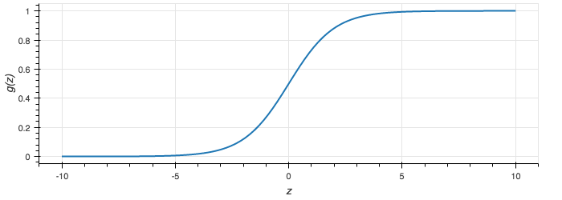

### 2.2 Fronteira de decisão

<!-- fronteira de decisão -->
Na regressão logística, interpretamos o resultado de $\hat{f}(x)$ como a
probabilidade da resposta ser 1 para o vetor de características $x$. Assim, se
$\hat{f}(x) = 0,8$, então $x$ tem probabilidade $0,8$ de ser da classe 1, e
$0,2$ de ser da classe 0.

Para obter uma classificação discreta a partir do resultado da função logística,
é necessário definir um limiar que vai especificar qual a classificação dada
pelo algoritmo. 

Por exemplo, podemos definir o limiar em $0,5$ para atribuir $y=1$ se $\hat{f}(x)
\geq 0,5$, ou seja, $y=1$ se a probabilidade da resposta ser 1 for maior ou
igual a 50%. Consequentemente, $y=0$ é atribuído se $\hat{f}(x) < 0,5$, ou seja,
$y=0$ se a probabilidade da resposta ser 1 for menor que 50%.

Na função logística, se $z \geq 0$, então $g(z) \geq 0,5$.
Como temos a função estimada $\hat{f}(x) = g(w^Tx)$, então,
se $w^Tx \geq 0$, isto resulta em $g(z) \geq 0,5$.

Dessa forma, podemos interpretar $w^Tx$ como uma fronteira de decisão que separa
os exemplos que são classificados como 0 ou 1.

Definimos matematicamente a fronteira de decisão da seguinte forma:

$$w^Tx = 0 $$

Assim:

$$w^Tx \geq 0 \Rightarrow y = 1$$

$$w^Tx < 0 \Rightarrow y = 0$$

O formato da fronteira de decisão é definido de acordo com a função $w^Tx$.
Por exemplo, usando a função $\hat{f}(x) = g(w_0 + w_1x_1 + w_2x_2)$, definimos a fronteira como:

$$w_0 + w_1x_1 + w_2x_2 = 0$$

Essa equação define uma reta.

A Figura 2, mostra um exemplo de classificação utilizando a equação da reta anterior para 
$w^T = \begin{bmatrix} -3 & 0,8 & 1 \end{bmatrix}$, ou seja, a equação $0,8x_1 + x_2 - 3 = 0$.
Note que no gráfico, os pontos são separados em dois grupos pela reta. Os pontos a esquerda 
da reta (azul) tem classificação 0, os pontos a direita (vermelho) tem classificação 1.

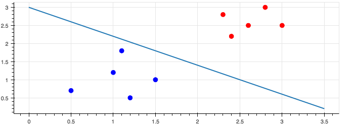

Usando funções diferentes, podemos ter curvas mais complexas. Na Figura 3 é
mostrada a fronteira para $\hat{f}(x) = g(-1,2 + 3x_1^2 + 3x_2^2)$, ou seja, a elipse
$3x_1^2 + 3x_2^2 - 1,2 = 0$. Os pontos que estão fora da elipse
possuem classificação $y=1$ e os que estão dentro possuem classificação $y=0$.

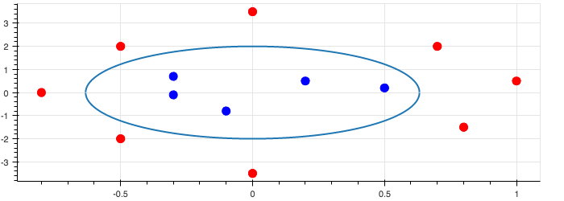

### 2.3 Função de erro
<!-- função de custo -->

Assim como na regressão linear e na regressão polinomial, para encontrar os valores dos coeficientes $w$,
vamos utilizar a descida de gradiente para minimizar uma função de erro. Na regressão logística, a função
de erro é definida por:

$$J(w) = \frac{1}{m} \sum_{i=1}^{m} Cost(f(x^{(i)}), y^{(i)})$$

Onde $m$ é a quantidade de exemplos de treinamento.

A função de erro $J$ é definida utilizando a função $Cost$ que calcula o custo
entre $f(x^{(i)})$ e $y^{(i)}$. A definição de $Cost$ depende do valor de y.

Para $y=1$, temos:

$$Cost(f(x), y) = -\log(f(x))$$

Nesse caso, quanto mais próximo de 1 for $f(x)$, mais próximo de 0 é o valor de
$Cost$. Caso contrário, quanto mais próximo de 0 for $f(x)$, mais próximo de
infinito é o valor de $Cost$.

Para $y=0$, temos:

$$Cost(f(x), y) = -\log(1 - f(x))$$

Nesse caso temos o oposto, quanto mais próximo de 0 for $f(x)$, mais próximo
de 0 é o valor de $Cost$ e quanto mais próximo de 1 for $f(x)$, mais próximo de
infinito é o valor de $Cost$. 

Com isso, se o modelo atribui probabilidades altas de forma correta para as
classificações dos exemplos, então o valor de $J(w)$ é baixo. Caso contrário,
se ele atribui de forma errada probabilidades altas, o valor de $J(w)$ tende a
infinito.

A Figura 4 mostra os gráficos de como os valores de $Cost$ variam de acordo com os valores
de $f(x)$. Na esquerda tem-se os valores para $y=1$ e na direita para $y=0$.

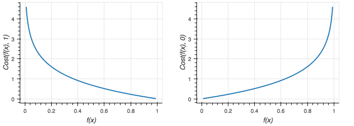

A função $Cost$ pode ser escrita de forma condensada da seguinte maneira:

$$Cost(f(x), y) = -y\log(f(x)) - (1-y)\log(1-f(x))$$

Note que quando $y=1$, a função se resume a $Cost(f(x), y) = -\log(f(x))$ e
quando $y=0$ ela tem a forma $Cost(f(x), y) = -\log(1-f(x))$. Ou seja, as
mesmas definições mostradas anteriormente.

Substituindo a definição condensada de $Cost$ na função de erro, temos:

$$J(w) = \frac{1}{m} \sum_{i=1}^{m} [-y^{(i)}\log(f(x^{(i)})) - (1-y^{(i)})\log(1-f(x^{(i)}))]$$

Para simplificar, multiplicamos todo o somatório por $-1$ para trocar os sinais internos.

$$J(w) = -\frac{1}{m} \sum_{i=1}^{m} [y^{(i)}\log(f(x^{(i)})) + (1-y^{(i)})\log(1-f(x^{(i)}))]$$

Com a função $J(w)$ em mãos, basta utilizar a descida de gradiente para encontrar os valores
dos coeficientes $w$. A seguir veremos um exemplo da aplicação do algoritmo.

### 2.4 Exemplo
<!-- exemplo - descida de gradiente - iris dataset - fazer com reta e com polinomio -->

A Figura 5 traz informações sobre dois tipos de flores: setosa (pontos azuis) e
versicolor (pontos vermelhos). Sendo 50 flores do primeiro tipo e 50 do
segundo. Cada flor no gráfico é representada por duas características:
comprimento da sépala ($x_1$) e largura da sépala ($x_2$).
Para a regressão logística, consideraremos que o tipo setosa corresponde a $y=0$
e o tipo versicolor a $y=1$.

Dados os exemplos de treinamento, vamos usar a regressão logística para
definir uma fronteira de classificação para os dois tipos de flores. Para isso,
utilizaremos o algoritmo de descida de gradiente para minimizar a função de erro $J$.

Para descobrir a direção que os coeficientes precisam ser ajustados em cada passo
do algoritmo precisamos da derivada parcial da função de erro:

$$\frac{\partial}{\partial w_j} J(w) = \frac{1}{m} \sum_{i=1}^{m} (f(x^{(i)}) - y^{(i)})x_j^{(i)}$$

Com isso, o algoritmo atualiza, até uma condição de parada, os valores dos coeficientes da seguinte forma:

$$w_j := w_j - \alpha \frac{\partial}{\partial w_j} J(w)$$

ou seja,

$$w_j := w_j - \alpha \frac{1}{m} \sum_{i=1}^{m} (f(x^{(i)}) - y^{(i)})x_j^{(i)}$$

onde $j$ varia de 0 até $N$, sendo $N+1$ o total de coeficientes e $\alpha$ a taxa de aprendizagem.

Aplicando a descida de gradiente para:

- $f(x) = g(w_0 + w_1x_1 + w_2x_2)$;
- $\alpha = 0,1$;
- Todos os coeficientes inicializados com valor 0.

A reta encontrada após mil iterações do algoritmo é: $-3,3872 + 6,055x_1 -9,5045x_2 = 0$, como
representada na Figura 6.

Para testar a classificação, calcularemos $w^Tx$ para uma entrada e aplicaremos o resultado à função logística.
A Figura 7 traz dois pontos em verde que serão classificados, além dos pontos e a reta da Figura 6.
Um dos pontos tem $x_1 = 6$ e $x_2 = 2$ e o outro ponto tem $x_1 = 4$ e $x_2 = 4$.

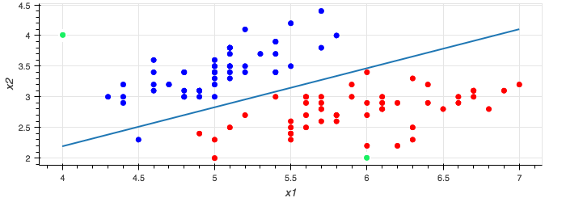

Para o ponto $(6, 2)$, temos:

$$w^Tx = \begin{bmatrix} -3,3872 & 6,055 & -9,5045 \end{bmatrix} . \begin{bmatrix} 1 \\ 6 \\ 2 \end{bmatrix} = 13,9337 $$ 

$$\frac{1}{1+e^{-13,9337}} = 0,9999$$ 

Assim, a probabilidade do ponto $(6, 2)$ ser do tipo $y=1$ (versicolor) é de 99,99%.

Para o ponto $(4, 4)$, temos:

$$w^Tx = \begin{bmatrix} -3,3872 & 6,055 & -9,5045 \end{bmatrix} . \begin{bmatrix} 1 \\ 4 \\ 4 \end{bmatrix} = -17.1852 $$ 

$$\frac{1}{1+e^{7,6807}} = 0.00000003$$ 

Assim, a probabilidade do ponto $(4, 4)$ ser do tipo $y=1$ (versicolor) é de 0,000003%, ou seja, 99,999997% de ser $y=1$ (setosa).

Utilizando outra função, podemos encontrar uma fronteira diferente. Executando a descida de gradiente para 
$f(x) = g(w_0 + w_1x_1 + w_2x_2^2)$, encontramos a curva $-27,6512 + 8,0858x_1 - 1,6503x_2^2 = 0$. A fronteira
pode ser visualizada na Figura 8.

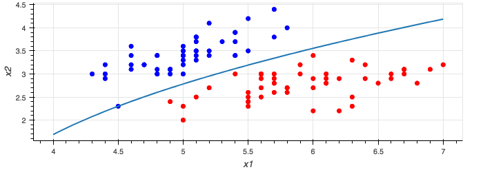

O processo para classificar novas entradas é o mesmo feito anteriormente, bastando calcular o valor de $w^Tx$ e
aplicar o resultado à função logística.

### 2.5. Classificação multiclasse
<!-- classificação multiclasse -->
Os exemplos anteriores utilizaram dados que possuíam apenas duas
classificações, entretanto a regressão logística pode ser usada em problemas
com um número maior de classes. Para isso, utilizaremos a técnica
**um-contra-todos**.

A Figura 9 traz 12 exemplos num plano cartesiano, sendo 3
exemplos com a classificação verde, 4 com a classificação vermelha e 5 com a
classificação azul.

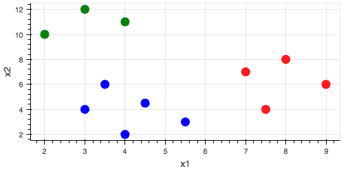{ width=80% }

A técnica um-contra-todos divide um problema de classificação com N classes em N problemas de classificação.
Dessa forma, o nosso exemplo se transforma em três problemas de classificação. Para isso, escolhemos uma classe
e consideraremos todos os exemplos com as outras classes como uma classe única.

A Figura 10 mostra os dados para os três problemas de classificação criados a
partir do problema inicial. No plano de cima a classe verde foi escolhida e as
outras duas classes são consideradas como uma só (cor cinza), no plano do meio a classe
azul foi escolhida e no plano de baixo foi escolhida a classe vermelha.

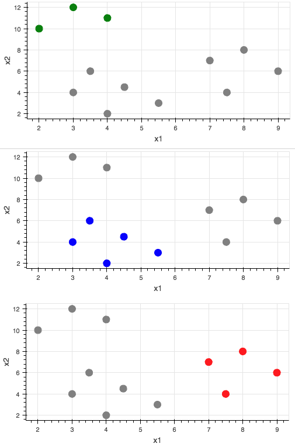{ width=80% }

A classe escolhida deve ser considerada como o valor $y=1$, as outras classes devem ser o $y=0$. Com isso,
ao treinar um classificador usando regressão logística, conseguiremos saber qual a probabilidade de um exemplo
de teste ter a classe escolhida.

Para saber qual classe atribuir a um exemplo de teste, treinamos o classificador para cada conjunto de dados mostrados na Figura 10. Em seguida, usamos a função estimada para cada conjunto de dados para saber qual a probabilidade do exemplo de teste ser da classe $y=1$, ou seja, a classe escolhida. Por fim, atribuímos ao exemplo de teste, a classe com a maior probabilidade. 

## 3. K vizinhos mais próximos (KNN)

<!-- definição -->
O algoritmo K vizinhos mais próximos, muito conhecido pelo sua sigla em inglês
KNN (K Nearest Neighbors), é um classificador baseado em instâncias. Nele, o
treinamento consiste em apenas guardar os dados de treinamento e a
classificação é realizada de acordo com exemplos similares a um exemplo de
entrada.

<!-- vantagens -->
Com essa abordagem, o classificador não possui uma função estimada única para
todas as entradas como na regressão logística, pois cada nova entrada é
comparada com exemplos similares para atribuição de uma classificação. Assim, o
KNN pode representar funções estimadas complexas de uma forma simples.

<!-- desvantagens -->
Por outro lado, adiar grande parte do processamento para a etapa de
classificação, torna o custo de classificar novas entradas alto, o que pode
virar um gargalo numa aplicação. Isto não acontece, por exemplo, com as
regressões. Nelas, a maior parte do processamento é concentrada na fase de
treinamento, sendo a classificação de novas entradas computada rapidamente.

Por transferir o processamento de uma fase inicial (treinamento) para uma fase
posterior (classificação), os métodos usados nos classificadores baseados em
instâncias são conhecidos como *lazy learning* (aprendizagem preguiçosa).

Outra desvantagem dos classificadores baseados em instâncias é que eles
consideram todos os atributos dos exemplos, tornando essa abordagem pouco
robusta a ruídos nos dados. Por exemplo, se nos dados de treinamento existem 10
características, mas apenas 3 são importantes para o problema, um classificador
baseado em instâncias não consegue filtrar as 7 características irrelevantes.

### 3.1 Treinamento e classificação
<!-- como funciona o treinamento e a classificação -->
O KNN assume que cada exemplo dos dados de treinamento corresponde a um ponto num espaço n-dimensional.
Sendo o número de dimensões igual ao número de características dos exemplos. Por exemplo, a Tabela 1
mostra 5 exemplos de treinamento com duas características, $x_1$ e $x_2$, e uma resposta $y$.
A Figura 11 mostra os exemplos da Tabela 1 graficamente num espaço bidimensional.

Table: Dados de treinamento para o KNN

|  $x_1$  |  $x_2$  |   $y$    |
|:-------:|:-------:|:--------:|
| 1       | 2       | azul     |
| 2       | 3       | azul     |
| 3       | 1       | azul     |
| 4       | 4       | vermelho |
| 5       | 2       | vermelho |

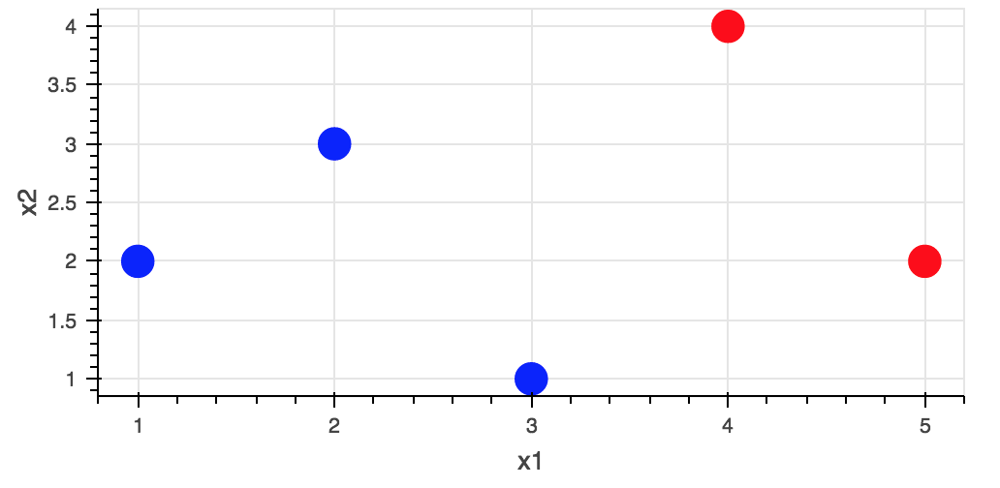{ width=80% }

A etapa de treinamento apenas armazena os pontos representados pelos exemplos de treinamento para eles serem usados na fase de classificação.

Na classificação, dado um exemplo de teste, que também será representado por um ponto no espaço, o algoritmo
compara os vizinhos mais próximos dele para decidir qual a classe a ser atribuída. A quantidade de vizinhos
mais próximos comparados é definida pela constante $K$, assim, usando $K=1$ o algoritmo compara
um vizinho mais próximo, para $K=2$ ele compara 2, para $K=3$ ele compara 3, etc.

<!-- calculando distâncias -->
Para saber quais os vizinhos mais próximos é necessário calcular a distância entre os pontos no espaço.
Usualmente é utilizada a distância euclidiana, mas podemos usar outras distâncias nessa etapa.
A distância euclidiana entre dois pontos $a=(a_1, a_2)$ e $b=(b_1, b_2)$ é definida por:

$$d(a,b) = \sqrt{(a_1 - b_1)^2 + (a_2 - b_2)^2}$$

Generalizando para pontos com n dimensões, por exemplo 
$a=(a_1, a_2, ..., a_n)$ e $b=(b_1, b_2, ..., b_n)$, temos:

$$d(a,b) = \sqrt{\sum_{i=1}^{n} (a_i - b_i)^2}$$

Após encontrar os K vizinhos mais próximos através do cálculo das distâncias, o algoritmo atribui como classificação do exemplo de entrada a resposta mais frequente nos K vizinhos mais próximos.

Por exemplo, na Figura 12, adicionamos um ponto verde $(x_1=3,2; x_2=3,8)$ representando um exemplo de teste. Nela, podemos observar a distância do exemplo de teste para todo os pontos dos dados de treinamento. Assim, usando $K=1$, o algoritmo analisa o vizinho mais próximo, nesse caso o ponto $(x_1=4; x_2=4)$ e atribui a classificação desse ponto (vermelho) ao exemplo de teste.
Utilizando $K=3$, o algoritmo analisa os três vizinhos mais próximos, ou seja, os pontos $(x_1=4; x_2=4)$,  $(x_1=2; x_2=3)$ e  $(x_1=4; x_2=4)$  $(x_1=5; x_2=2)$. Desses três pontos, dois possuem a classificação vermelha e um possui a classificação azul. Como a classificação vermelha aparece mais vezes nos K vizinhos mais próximos, então ela é a classificação atribuída ao exemplo de teste.

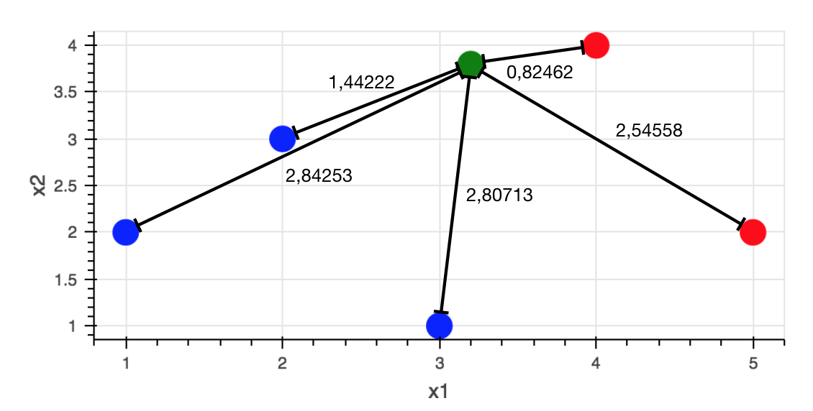{ width=80% }

### 3.2. Respostas contínuas
<!-- knn para respostas contínuas -->

O KNN pode ser modificado para ser usado em problemas com respostas contínuas
(regressão). Para isso, o algoritmo deve ser executado do mesmo modo explicado
anteriormente, a única diferença é a forma como a resposta é atribuída a um
exemplo de teste.

Ao invés de escolher o valor que mais aparece nos K vizinhos mais próximos,
para regressão vamos calcular a média das respostas e atribuir ao exemplo que
está sendo classificado. Ou seja, encontrando K vizinhos mais próximos com
respostas $y^{(i)}$, a resposta atribuída será a média:

$$\hat{y} = \frac{1}{K}\sum_{j=1}^{K} y^{(j)}$$

### 3.3. K-D Trees

<!-- - KNN pode ser lento (mostrar ordem de complexidade) -->
Grande parte do processamento do algoritmo KNN é feita durante a classificação,
pois para cada nova entrada é necessário comparar a sua distância com todos os
exemplos de treinamento. Assim, a classificação tem complexidade
$\mathcal{O}(N)$. Dependendo da quantidade de dados de treinamento, com a
complexidade linear, esse tempo de execução pode ser aceitável. Entretanto,
como em diversos problemas de aprendizagem de máquina, podemos ter conjuntos de
dados de treinamento muito grandes, tornando o uso do KNN inviável.

<!-- - KD Trees reduzem complexidade -->
Uma estratégia para reduzir o número de comparações durante a classificação no
KNN é utilizar uma K-D Tree (K-Dimensional Tree). Ela organiza os dados de treinamento
numa árvore, possibilitando uma busca mais eficiente por vizinhos mais próximos.
Usando uma K-D Tree a complexidade da classificação se torna $\mathcal{O}(\log N)$.

<!-- - algoritmo com exemplo -->

A Tabela 2 traz 10 exemplos representados por duas características ($x_1, x_2$). Esses mesmos dados
são apresentados num plano na Figura 13. A partir desses exemplos, nas subseções seguintes, criaremos
uma K-D Tree e executaremos a busca de pontos mais próximos usando essa estrutura de dados.

Table: Exemplos para geração da K-D Tree

|  $x_1$  |  $x_2$  |
|:-------:|:-------:|
| 1       | 9       |
| 2       | 3       |
| 3       | 1       |
| 3       | 7       |
| 5       | 4       |
| 6       | 8       |
| 7       | 2       |
| 8       | 8       |
| 7       | 9       |
| 9       | 6       |

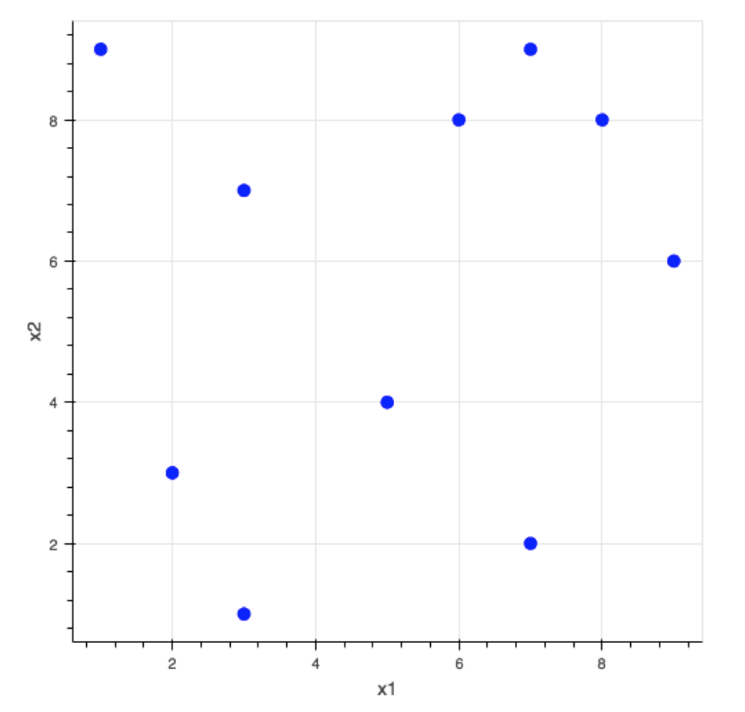{ width=65% }

#### 3.3.1 Criando uma K-D Tree

Para criar uma K-D Tree, começamos escolhendo uma das duas dimensões
(características) para separar os nossos pontos em dois grupos, nesse exemplo,
iniciaremos com $x_1$.

Vamos dividir os dados na dimensão $x_1$ pela metade, para isso, calculamos a
mediana das características $x_1$, que nesse exemplo é igual a $5,5$.  Dessa forma, geramos
dois grupos, um com todos os pontos que possuem $x_1 < 5,5$ e o outro com todos
os pontos que possuem $x_1 \geq 5,5$. A Figura 14a mostra os dois grupos
criados.

No passo seguinte, continuamos dividindo os dados, mas agora alternamos a
dimensão usada.  Cada grupo gerado no passo anterior é subdividido em dois
novos grupos. Para isso, calculamos a mediana dos valores $x_2$ para cada um
dos grupos. O grupo da esquerda tem mediana dos valores de $x_2$ igual a $4$ e o
grupo da direita tem mediana igual a $8$.  A Figura 14b mostra as novas divisões criadas
nos dados.

Esse processo de divisão pela mediana alternando a dimensão usada continua até que um grupo
tenha um limite máximo de pontos.  Essa quantidade é um parâmetro que deve ser
definido na criação da K-D Tree. É comum dividir os dados até
que cada grupo tenha um único ponto, mas, para o KNN, podemos ter grupos com
mais pontos. No nosso exemplo, usaremos um valor máximo de 2 pontos, ou seja,
os dados serão divididos até que um grupo tenha 2 ou menos pontos.
A Figura 14c traz os dados divididos após a criação da árvore.

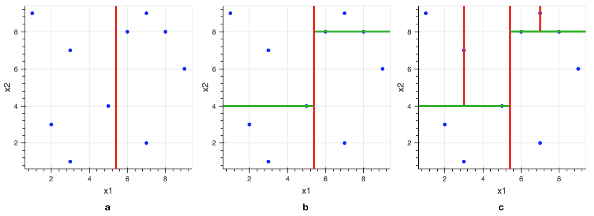{ width=100% }

Como era de se esperar, também podemos visualizar os dados como uma árvore.
A Figura 15 apresenta a K-D Tree gerada. Cada nó apresenta o critério de divisão
dos dados, especificando qual dimensão foi usada e qual o valor de corte.
A esquerda do nó ficam os pontos com valores menores que o ponto do corte e a direita
os com valores maiores ou iguais ao ponto de corte. As coordenadas dos pontos são mostradas
nos ramos interligando os nós. Por fim, as folhas possuem os valores dos pontos em
cada grupo.

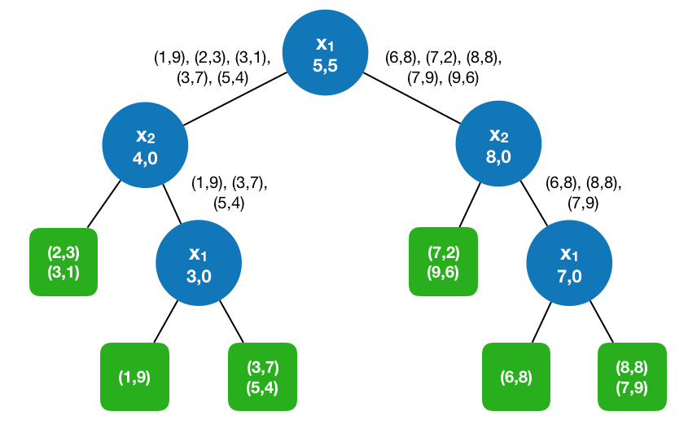{ width=70% }

#### 3.3.2 Buscando vizinhos mais próximos

Com a K-D Tree criada, vamos buscar o vizinho mais próximo para um ponto de entrada, na explicação
que segue, usaremos o ponto $(6,4)$.

O primeiro passo para encontrar o vizinho mais próximo do ponto $(6,4)$ é explorar a árvore até
chegar no grupo que contenha esse ponto.
Começando pela raiz, verificamos que a coordenada $x_1$ do ponto $(6,4)$ é maior que $5,5$, assim
o algoritmo segue para o nó da direita. Verificando a coordenada $x_2$ temos que $4$ é menor que $8$,
com isso, terminamos na folha que contém os pontos $(7,2)$ e $(9,6)$. A Figura 16 mostra o ponto $(6,4)$
em verde no plano e o grupo a que ele pertence em destaque.

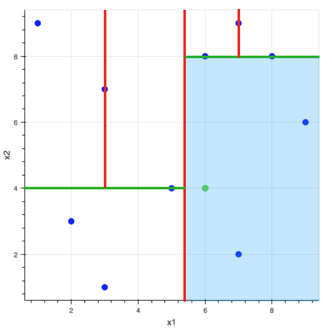{ width=65% }

Sabendo a que grupo o ponto pertence,
vamos descobrir qual ponto desse grupo é o mais próximo do ponto de entrada.
Nesse caso, apenas duas distâncias são calculadas, a distância para o ponto
$(7,2)$ e a para o ponto $(9,6)$. Utilizando a distância euclidiana, concluímos que o 
ponto $(7,2)$ é o mais próximo de $(6,4)$.

Apesar de $(7,2)$ ser o ponto mais próximo dentro do grupo, visualmente
percebemos que ele não é o ponto mais próximo globalmente. Para qualquer caso,
não temos a garantia que o ponto mais próximo dentro do grupo que o ponto de entrada pertence
é o mais próximo globalmente. Por isso, precisamos continuar a procura por
pontos mais próximos. 

Usando a K-D Tree podemos filtrar alguns grupos para que a quantidade de
cálculos realizados seja menor. 
Para descobrir que grupos não precisam ser analisados, primeiramente
armazenamos numa variável R a distância entre o ponto de entrada e o ponto mais próximo
no grupo que ele pertence. Em seguida, traçamos uma circunferência com raio R a partir
do ponto de entrada. A Figura 17 apresenta essa circunferência, note que o raio no
nosso exemplo, é igual a distância entre $(6,4)$ e $(7,2)$.

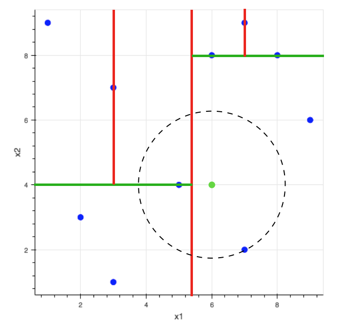{ width=65% }

O algoritmo continua visitando os ramos que não foram explorados ainda
para procurar pontos mais próximos ao ponto de entrada.
Porém, se a distância do ponto de entrada para o grupo representado por um nó da
árvore for maior que o raio da circunferência, esse ramo é ignorado, pois é
impossível ter um ponto mais próximo do que o já encontrado.  Visualmente, todo
grupo que não for cortado pela circunferência ou não estiver dentro dela, deve
ser ignorado.  Para o nosso exemplo, apenas os grupos destacados na Figura 18
precisam ser explorados.

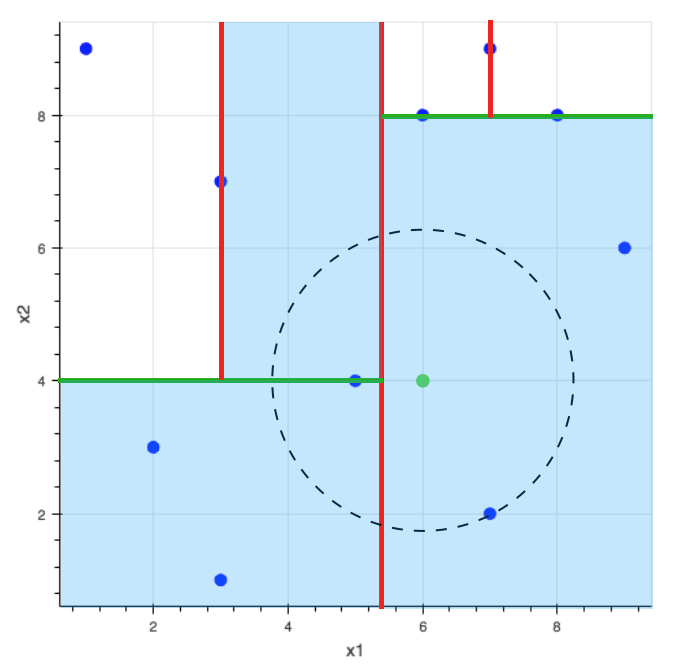{ width=65% }

Ao analisar um grupo, se for encontrado um ponto mais próximo do ponto de
entrada, a circunferência deve ser atualizada. Ela terá raio igual a nova
distância encontrada. Como a distância será menor, a circunferência será menor
e possivelmente mais grupos serão filtrados. No nosso exemplo, ao analisar o
grupo destacado na Figura 19, o algoritmo encontra um ponto mais próximo de
$(6,4)$, nesse caso, o ponto $(5,4)$. A Figura 19 também apresenta a
circunferência com o raio atualizado.

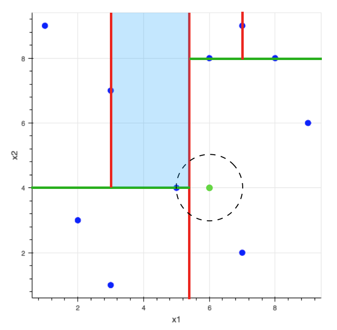{ width=65% }

Este é o último grupo analisado, assim o algoritmo termina encontrando o
vizinho (5,4) como sendo o mais próximo do ponto de entrada (6,4). Utilizando a
K-D Tree o algoritmo conseguiu evitar algumas comparações, diminuindo a
quantidade de cálculos necessários para encontrar o vizinho mais próximo.

<!-- - mostrar como encontrar K pontos mais próximos -->
Para encontrar K vizinhos mais próximos, ao invés de apenas 1, o algoritmo pode ser modificado
para levar em consideração as K menores distâncias encontradas. Assim, um grupo
só é filtrado se já tiverem sido encontrados K pontos mais próximos 
e se a distância do grupo para o ponto de entrada for maior que todas as K menores distâncias.

## 4. Naive Bayes

<!-- definição -->
O Naive Bayes é um classificador que utiliza probabilidades
para classificar um exemplo de teste.
Por exemplo, dado um problema com
$C$ possíveis classes e um exemplo de teste definido pelo vetor de características 
$[a_1$, $a_2$, ..., $a_n]$, o classificador atribui ao exemplo de teste 
a classificação $R$ definida por:

$$R = argmax_{(c \in C)} P(c | a_1, a_2, ..., a_n)$$

Ou seja, o exemplo de teste é classificado com a classe $c$ que maximiza o valor de $P(c | a_1, a_2, ..., a_n)$.

<!-- teorema de bayes -->
Utilizando o teorema de Bayes podemos reescrever a expressão $P(c | a_1, a_2, ..., a_n)$ da seguinte forma:

$$P(c | a_1, a_2, ..., a_n) = \frac{ P(a_1, a_2, ..., a_n | c)P(c)}{ P(a_1, a_2, ..., a_n)}$$

Substituindo na fórmula para encontrar R, temos:

$$R = argmax_{(c \in C)}  \frac{ P(a_1, a_2, ..., a_n | c)P(c)}{ P(a_1, a_2, ..., a_n)}$$

Perceba que para um mesmo exemplo de teste, o valor de $P(a_1, a_2, ..., a_n)$ é sempre igual. Assim,
quando estamos calculando as probabilidades para descobrir qual classe maximiza o valor de 
$\frac{ P(a_1, a_2, ..., a_n | c)P(c)}{ P(a_1, a_2, ..., a_n)}$, o denominador se mantém constante.
Portanto, para maximizar a probabilidade, basta maximizar o valor do numerador 
$P(a_1, a_2, ..., a_n | c)P(c)$.

### 4.1. Exemplo
<!-- exemplo de spam -->
Neste exemplo aplicaremos o classificador Naive Bayes a um problema de
detecção de Spam. Um e-mail recebido pode ser Spam ou pode não ser Spam, assim
os dados de treinamento para esse problema têm mensagens que foram
classificadas com essas duas possibilidades.

A Tabela 3 traz oito mensagens que serão usadas como dados de treinamento.
Nela, três mensagens são Spam (primeira coluna) e cinco não são Spam (segunda coluna).
Para fins didáticos, as mensagens são curtas e simples, mas o classificador
pode ser aplicado da mesma forma para mensagens maiores.

Table: Dados de treinamento para o problema de classificação de Spam

|        Spam       |       Não Spam      |
|:-----------------:|:-------------------:|
|  offer is secret  |   play sport today  |
| click secret link |   went play sport   |
| secret sport link | secret  sport event |
|                   |    sport is today   |
|                   |  sport costs money  |

Usando o Naive Bayes, vamos classificar a mensagem "secret is secret" para
saber se ela é Spam ou não.  Primeiramente, precisamos definir quais são as
características dos nossos exemplos. Num classificador de Spam, podemos usar as
palavras como as características. Com isso, o vetor de características do
exemplo "secret is secret" é: ["secret", "is", "secret"].

Dessa forma, temos que encontrar: 

$$R = argmax_{(c \in C)} P(c | ``secret", ``is" , ``secret")$$

Onde $C = \{Spam, Não Spam\}$.

Utilizando o Teorema de Bayes, e desconsiderando o denominador que é constante, escrevemos R como:

$$R = argmax_{(c \in C)} P(``secret", ``is", ``secret" | c)P(c)$$

<!-- calculando probabilidades -->

O cálculo de $P(c)$ é feito dividindo a contagem de quantas mensagens possuem a
classe $c$ nos dados de treinamento pelo total de mensagens. Assim, temos:

$$P(Spam) = \frac{3}{8} = 0,375$$

$$P(NãoSpam) = \frac{5}{8} = 0,625$$

Para calcular $P(``secret", ``is", ``secret" | c)$, o Naive Bayes supõe que a
ordem das palavras não importa e que as probabilidade das palavras são
independentes. Essa suposição não é verdadeira para um texto, sabemos que as
palavras não são escritas de forma independente e que a ordem importa, mas essa
suposição simplifica e agiliza os cálculos. A ingenuidade dessa suposição é o
motivo do nome do algoritmo (naive em inglês significa ingênuo).  Entretanto,
mesmo com essa suposição, em diversos casos, o Naive Bayes tem desempenho
similar a classificadores mais sofisticados.

Dessa forma, $P(``secret", ``is", ``secret" | c)$ se resume a: $P(``secret"|c)P(``is"|c)P(``secret"|c)$.

Substituindo na equação para encontrar $R$, temos:

$$R = argmax_{(c \in C)} P("secret"|c)P("is"|c)P("secret"|c)P(c)$$

Para calcular $P(``palavra"|c)$ precisamos contar quantas vezes "palavra" aparece na
classe $c$ e dividir pelo total de palavras na classe $c$. Assim, para calcular $P(``secret"|Spam)$
primeiro contamos quantas vezes "secret" aparece nos Spams e dividimos pelo total de palavras
nas mensagens da classe Spam:

$$P(``secret"|Spam) = \frac{3}{9} = 0,333$$

Da mesma forma, calculamos $P(``is"|Spam)$:

$$P(``is"|Spam) = \frac{1}{9} = 0,111$$

Com esses valores em mãos, concluímos que: 

$$P(``secret"|Spam)P(``is"|Spam)P(``secret"|Spam)P(Spam) = $$
$$0,333 \cdot 0,111 \cdot 0,333 \cdot 0,375 = 0,004629$$

Para a classe Não Spam, repetimos o mesmo procedimento.

$$P(``secret"|NãoSpam) = \frac{1}{15} = 0,0666$$

$$P(``is"|NãoSpam) = \frac{1}{15} = 0,0666$$

Assim: 

$$P(``secret"|NãoSpam)P(``is"|NãoSpam)P(``secret"|NãoSpam)P(NãoSpam) = $$
$$0,0666 \cdot 0,0666 \cdot 0,0666 \cdot 0,625 = 0,0001851$$

Comparando os resultados, classificamos a mensagem "secret is secret" como Spam,
pois essa classe obteve o maior valor. Intuitivamente
podemos perceber que isso era esperado, já que a palavra "secret" aparece com
maior frequência nos dados de treinamento para classe Spam do que para classe
Não Spam.

Os valores calculados não podem ser considerados probabilidades, apesar deles serem
proporcionais a $P(c | ``secret", ``is" , ``secret")$, pois retiramos o denominador
da fórmula do teorema de Bayes. A probabilidade pode ser obtida normalizando os valores
para que a soma deles seja 1. Assim, temos:

$$P(``secret", ``is", ``secret" | Spam) = \frac{0,004629}{0,004629+0,0001851} = 0,9615$$

$$P(``secret", ``is", ``secret" | NãoSpam) = \frac{0,0001851}{0,004629+0,0001851} = 0,03844$$

Ou seja, o Naive Bayes atribuiu 96,15% de probabilidade de "secret is secret" ser Spam e 3,84% de não ser.

### 4.2 Suavização
<!-- suavização -->

Vamos usar o Naive Bayes para classificar a mensagem "today is secret". Seguindo o algoritmo, precisamos encontrar:

$$R = argmax_{(c \in C)} P(``today"|c)P(``is"|c)P(``secret"|c)P(c)$$

As probabilidades das classes $P(Spam)$ e $P(NãoSpam)$, assim como as probabilidades das palavras "is" e "secret"
para ambas as classificações já foram calculadas anteriormente. Falta apenas calcular as probabilidades para a palavra
"today".

$$P(``today"|Spam) = \frac{0}{9} = 0$$

$$P(``today"|NãoSpam) = \frac{1}{15} = 0,666$$

Utilizando esses resultados, temos: 

$$P(``today"|Spam)P(``is"|Spam)P(``secret"|Spam)P(Spam) = $$
$$0 \cdot 0,111 \cdot 0,333 \cdot 0,375 = 0$$

Esse resultado não parece coerente, foi alterada apenas uma palavra em relação
ao exemplo anterior, porém o valor diminuiu bruscamente para a classe Spam.

Para a mensagem "today is secret" nós temos um problema, $P(``today" | spam) = 0$.
Como a palavra "today" não aparece nos dados de treinamento com a classificação Spam,
a sua probabilidade é zero. O zero torna todas as outras probabilidades irrelevantes,
pois zero multiplicado por qualquer valor é igual a zero. Assim, apenas uma palavra
está determinando o resultado final da classificação.

Para resolver isso, utilizaremos uma técnica chamada Suavização de Laplace. A
ideia dessa técnica é supor que cada palavra foi vista nos dados de treinamento
uma vez a mais, ou seja, vamos adicionar 1 em todas as contagens. Além disso,
na suavização vamos adicionar uma palavra "\<desconhecida\>" que vai representar
qualquer palavra que não esteja presente nos dados de treinamento. Com essa estratégia,
palavras que não existem terão probabilidades baixas, mas elas não serão zero.

A Tabela 2 mostra as contagens das palavras sem suavização e com suavização de acordo
com os dados de treinamento da Tabela 1.

\begin{table}[h]
\centering
\caption{Contagens das palavras dos dados de treinamento sem suavização e com suavização.}
\begin{tabular}{@{}cccccccc@{}}
\\
\toprule
\multicolumn{4}{c}{Spam}                                                & \multicolumn{4}{c}{Não Spam}                                            \\ \midrule
\multicolumn{2}{c}{Sem Suavização} & \multicolumn{2}{c}{Com suavização} & \multicolumn{2}{c}{Sem Suavização} & \multicolumn{2}{c}{Com suavização} \\ \midrule
offer              & 1             & offer              & 2             & play               & 2             & play               & 3             \\
is                 & 1             & is                 & 2             & sport              & 5             & sport              & 6             \\
secret             & 3             & secret             & 4             & today              & 2             & today              & 3             \\
click              & 1             & click              & 2             & went               & 1             & went               & 2             \\
link               & 2             & link               & 3             & secret             & 1             & secret             & 2             \\
sport              & 1             & sport              & 2             & event              & 1             & event              & 2             \\
                   &               & <desconhecida>     & 1             & is                 & 1             & is                 & 2             \\
                   &               &                    &               & costs              & 1             & costs              & 2             \\
                   &               &                    &               & money              & 1             & money              & 2             \\
                   &               &                    &               &                    &               & <desconhecida>     & 1              \\
                   &               &                    &               &                    &               &                    &               \\
Total              & 9             & Total              & 16            & Total              & 15            & Total              & 25            \\ \bottomrule
\end{tabular}
\end{table}

Com isso, podemos utilizar essas novas contagens para calcular as probabilidades
das palavras. De forma geral, definimos o cálculo da probabilidade utilizando
a suavização de Laplace como:

$$P_{Laplace}(palavra|c) = \frac{count(palavra, c) + 1}{N(c) + V(c) + 1}$$

Onde, $count(palavra, c)$ é a quantidade de vezes que a palavra aparece com a
classe $c$, $N(c)$ é a quantidade de palavras nos exemplos da classe $c$ e
$V(c)$ é o tamanho do vocabulário para a classe $c$.

Como estamos adicionando 1 para cada palavra existente nos dados de
treinamento, então o total de palavras precisa ser acrescido num valor igual à
quantidade de palavras únicas, ou seja, o tamanho do vocabulário. 
Além disso, somamos 1 ao total de palavras do vocabulário para
representar a possibilidade de palavras desconhecidas.

<!--  TODO: calcular a classificação de today is secret usando suavizacao ... -->
Vamos recalcular as probabilidades para classificar a mensagem "today is secret", mas
agora utilizando a suavização de Laplace. Iniciaremos calculando as probabilidades
das palavras:

$$P(``today"|Spam) = \frac{0 + 1}{9 + 6 + 1} = \frac{1}{16} = 0,0625$$

$$P(``is"|Spam) = \frac{1 + 1}{9 + 6 + 1} = \frac{2}{16} = 0,125$$

$$P(``secret"|Spam) = \frac{3 + 1}{9 + 6 + 1} = \frac{4}{16} = 0,25$$

Assim:

$$P(``today"|Spam)P(``is"|Spam)P(``secret"|Spam)P(Spam) = $$
$$0,0625 \cdot 0,125 \cdot 0,25 \cdot 0,375 = 0,0007324$$

Para classe Não Spam o resultado é:

$$P(``today"|NãoSpam)P(``is"|NãoSpam)P(``secret"|NãoSpam)P(NãoSpam) =$$
$$0,0004799$$

Com isso, a mensagem "today is secret" é classificada como Spam, pois essa classe obteve o maior valor.

### 4.3 Underflow
<!-- underflow -->

No cálculo da probabilidade de uma mensagem dada uma classe é necessário
multiplicar as probabilidades de cada palavra. Como probabilidades são valores
entre 0 e 1, multiplicar muitos valores dessa grandeza pode resultar em números
extremamente pequenos. Por isso, é importante ficar atento para casos que
resultam em underflow. O underflow acontece quando o resultado de um cálculo é
tão próximo de zero que o computador não consegue diferenciá-lo do próprio
zero, ou seja, o valor está além dos limites de representação do computador.

Para evitar problemas de underflow, podemos calcular o logaritmo da multiplicação das probabilidades. Assim, temos:

$$\log( P(a_1|c)P(a_2|c)...P(a_n|c) ) = \log(P(a_1|c)) + \log(P(a_2|c)) + ... + \log(P(a_n|c))$$

Note que ao invés da multiplicação, usando o $\log$, nós somaremos os valores, evitando o underflow pela multiplicação de valores muito pequenos.

\  

## Referências

- Livro: Machine Learning (1a edição). Mitchell, T.
- Curso: Machine Learning - Stanford University. Ng, A.
- Curso: Natural Language Processing - Stanford University. Jurafsky, D., Manning, C.
- Curso: Machine Learning: Clustering & Retrieval - University of Washington. Fox, E., Guestrin, C.
