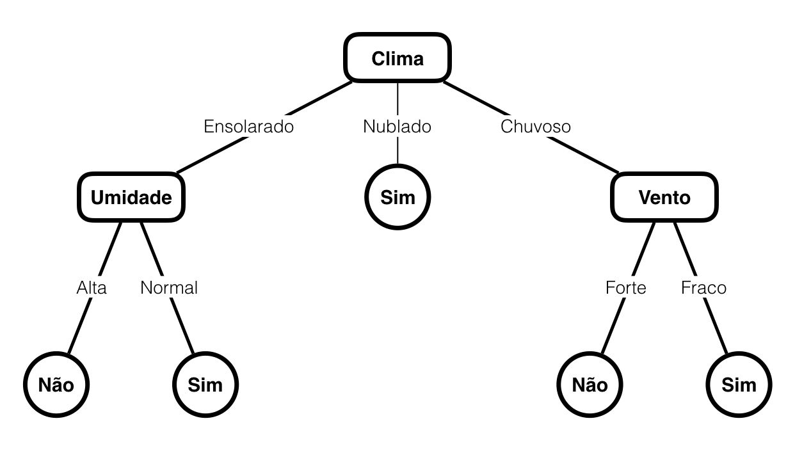
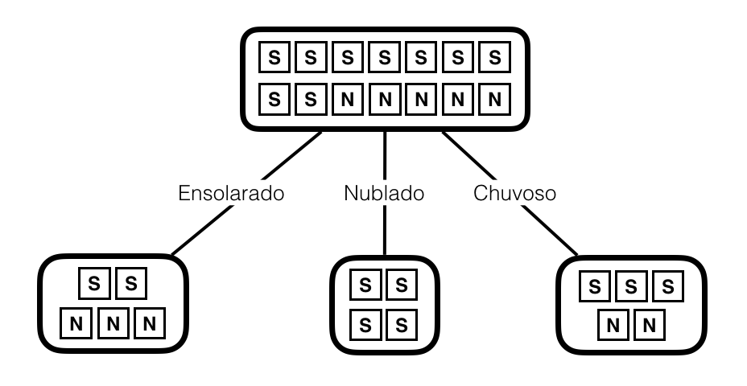
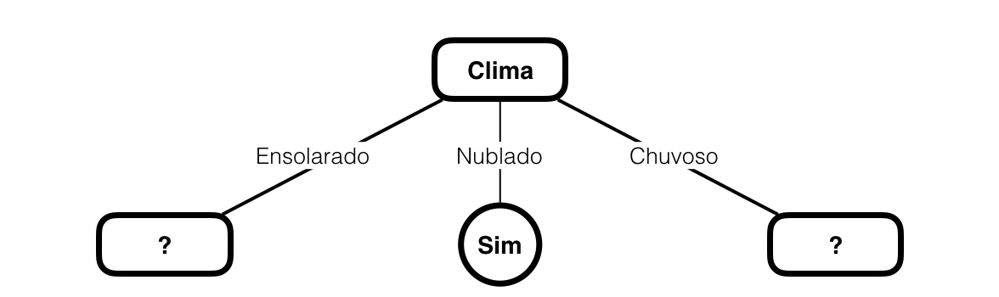

% Notas de Aula - Inteligência Artificial
% Yuri Malheiros
% UFPB - Campus IV - Rio Tinto

# Árvores de decisão

## 1. Introdução

A aprendizagem por árvores de decisão é um das formas mais simples e populares
de aprendizagem de máquina aplicada com sucesso a diversos tipos de problemas.
Uma árvore de decisão representa uma função que recebe como entrada um vetor de
valores de atributos e, através de uma sequência de testes, retorna uma decisão
formada por um único valor.

## 2. Representação da árvore de decisão

Numa árvore de decisão cada nó representa um teste que avalia o valor de um
atributo fornecido como entrada. Os nós possuem ramificações que vão ligá-los a
outros nós, cada uma delas corresponde a um dos possíveis valores do atributo
testado pelo nó.

Para tomar uma decisão, ou em outras palavras, para classificar uma entrada, os
testes começam a partir da raiz da árvore. Assim é avaliado qual o valor do
atributo correspondente a esse nó. Com esse valor em mãos, move-se através da
ramificação correspondente a ele até chegar num novo nó. O mesmo processo é
realizado para o próximo nó e ele se repete até que o nó encontrado seja uma
folha da árvore. O nó folha de uma árvore de decisão corresponde ao resultado
final, ou seja, a decisão tomada.

A Figura 1 traz um exemplo de árvore de decisão. Ela toma uma decisão se um
dia, de acordo com os atributos *Clima*, *Umidade* e *Vento*, está propício para
jogar tênis ou não. Note que o atributo da raiz é o atributo *Clima*, assim ele
é o primeiro teste a ser feito. Dependendo do vetor de valores de atributos de
entrada, pode ser necessário testar o atributo *Umidade* ou *Vento*, mas, se o
valor do atributo *Clima* for *Nublado*, então a decisão *Sim* já é tomada,
pois *Sim* é um nó folha.

Para tomar uma decisão usando a árvore de decisão da Figura 1 a partir da
entrada: $\{Clima=Ensolarado, Umidade=Alta, Vento=Forte\}$, primeiramente é
testado o atributo *Clima* que é a raiz da árvore. Na entrada, o valor de
*Clima* é *Ensolarado*, assim seguimos a ramificação com esse valor para chegar
no nó *Umidade*. O valor de *Umidade* na entrada é *Alta*, seguindo a
ramificação com esse valor chegamos ao nó *Não* que é um no folha, logo é a
decisão retornada pela árvore.

## 3. Indução a partir de exemplos

Para criar uma árvore de decisão é necessário um conjunto de dados de
treinamento com exemplos, cada um deles consistindo num vetor de valores de
atributos e uma classificação (rótulo). A Tabela 1 traz um conjunto de
treinamento que pode ser usado para criar uma árvore de decisão para o problema
de classificação de um dia propício para jogar tênis apresentado anteriormente.
O algoritmo processa o conjunto de treinamento para criar uma árvore consistente
com os exemplos, que possui o conhecimento para classificar novas entradas.

\pagebreak

Table: Dados de treinamento para o problema de classificação de um dia propício
para jogar tênis

Clima|Temperatura|Umidade|Vento|Jogar Tênis
:-----:|:-----:|:-----:|:-----:|:-----:
Ensolarado| Quente| Alta| Fraco| Não
Ensolarado| Quente| Alta| Forte| Não
Nublado| Quente| Alta| Fraco| Sim
Chuvoso| Moderado| Alta| Fraco| Sim
Chuvoso| Frio| Normal| Fraco| Sim
Chuvoso| Frio| Normal| Forte| Não
Nublado| Frio| Normal| Forte| Sim
Ensolarado| Moderado| Alta| Fraco| Não
Ensolarado| Frio| Normal| Fraco| Sim
Chuvoso| Moderado| Normal| Fraco| Sim
Ensolarado| Moderado| Normal| Forte| Sim
Nublado| Moderado| Alta| Forte| Sim
Nublado| Quente| Normal| Fraco| Sim
Chuvoso| Moderado| Alta| Forte| Não

Os principais algoritmos para criação de árvores de decisão são baseados num
algoritmo chamado ID3. Ele funciona através de uma abordagem gulosa, iniciando
a construção da árvore pela raiz e terminando nas folhas. Inicialmente, o
algoritmo escolhe o melhor atributo para ser a raiz da árvore, em seguida os
exemplos são divididos de acordo com os possíveis valores desse atributo,
gerando subconjuntos dos dados de treinamento. Por exemplo, se o atributo
*Vento* for escolhido para ser testado na raiz, então ele divide o conjunto da
Tabela 1 em dois subconjuntos, o primeiro com os exemplos que possuem
$Vento=Fraco$ e o segundo com os exemplos que possuem $Vento=Forte$.

Cada subconjunto vai originar um novo nó na árvore. Se todos os exemplos de um
subconjunto possuírem o mesmo rótulo, então o no será um nó folha representando
uma decisão com o valor correspondente a esse rótulo. Caso contrário, o
algoritmo continua escolhendo o melhor atributo para cada subconjunto gerado.
Esse atributo vai dividir os subconjuntos em novos subconjuntos da mesma forma
feita para a raiz da árvore. Esse processo segue até que a árvore seja
construída completamente. O algoritmo ID3 tenta construir uma árvore pequena e
consistente em relação aos exemplos, entretanto ele não garante que a menor
árvore é criada, pois o número de possíveis árvores para um conjunto de
treinamento é imenso, cerca de $2^{2^n}$, onde $n$ é o número de atributos.

### 3.1 Escolhendo os melhores atributos

Um dos pontos principais do algoritmo ID3 é a escolha do **melhor atributo** de
acordo com um conjunto de exemplos, entretanto esse conceito até então foi
usado de forma vaga. Ser o melhor atributo significa ser o atributo que melhor
divide um conjunto de exemplos de acordo com os rótulos.

Por exemplo, na Tabela 1, temos 14 exemplos, sendo 9 exemplos com rótulo *Sim*
e 4 exemplos com rótulo *Não*. Usando o atributo *Clima*, tem-se 3 possíveis
valores (*Ensolarado*, *Nublado* e *Chuvoso*), assim o conjunto de treinamento
é divido em 3 subconjuntos (um para cada possível valor do atributo *Clima*).
Nesse caso, 5 exemplos possuem o valor *Ensolarado*, sendo 2 com o rótulo *Sim*
e 3 com o rótulo *Não*. Para o valor *Nublado* tem-se 4 exemplos, sendo todos
eles com rótulo *Sim*. Por fim, 5 exemplos tem o valor *Chuvoso*, sendo 3 com o
rótulo Sim e 2 com o rótulo *Não*. A Figura 2 apresenta o resultado da divisão
dos exemplos usando o atributo *Clima*, os quadrados com a letra S representam
exemplos com o rótulo *Sim* e os quadrados com a letra N representam exemplos
com o rótulo *Não*.

Uma divisão boa é uma divisão que cria subconjuntos organizados, ou seja,
subconjuntos mais uniformes em relação aos valores dos rótulos. Continuando com
o nosso exemplo, o subconjunto dos exemplos que possuem o valor *Nublado* para
o atributo *Clima* é um subconjunto com boa organização, pois todos os eles
possuem o mesmo rótulo. Entretanto, os subconjuntos gerados pelos valores
*Ensolarado* e *Chuvoso* são mais desorganizados, pois os exemplos possuem
valores de rótulos misturados.

#### 3.1.1 Calculando a entropia

Quanto mais organizados (ou menos desorganizados) forem os subconjuntos gerados
pela divisão dos exemplos usando um atributo, melhor esse atributo é. Todavia,
o conceito de organizado e desorganizado ainda precisa ser definido com uma
maior exatidão. Para isso, vamos utilizar uma medida vinda da teoria da
informação chamada **entropia**, que mede a incerteza de uma variável
aleatória. Mais especificamente, para as árvores de decisão, a entropia mede o
grau de desorganização de um conjunto de exemplos levando em consideração os
valores dos rótulos.

Dado um conjunto $S$ de exemplos contendo dois tipos de rótulos (positivos e
negativos) a entropia de $S$ é calculada assim:

$$H(S) = -p_{\oplus} \log_2 p_{\oplus} - p_{\ominus} \log_2 p_{\ominus}$$

onde $p_{\oplus}$ é a proporção de exemplos positivos em $S$ e $p_{\ominus}$ a
proporção de exemplos negativos em $S$.

Definindo $S$ como o conjunto de exemplos da Tabela 1, temos que $p_{sim} = 9/14$
e $p_{não} = 5/14$. Note que a nomenclatura das proporções pode variar de acordo
com os rótulos definidos nos exemplos de treinamento, mas, independentemente dos nomes,
se o conjunto de exemplos possuir apenas 2 rótulos distintos, a fórmula para calcular
a entropia é a mesma. Assim, calculamos a entropia de $S$ da seguinte forma:

$$H(S) = -p_{sim} \log_2 p_{sim} - p_{não} \log_2 p_{não}$$

Substituindo os valores de $p_{sim}$ e $p_{não}$ temos:

$$H(S) = -(\frac{9}{14}) \log_2 (\frac{9}{14}) - (\frac{5}{14}) \log_2 (\frac{5}{14}) = 0.940$$

Para classificações booleanas (apenas dois rótulos distintos), a entropia tem
valor mínimo 0 e valor máximo 1. Quanto menor o valor, mais organizado é o
conjunto, quanto maior o valor, mais desorganizado é o conjunto. Se uma
proporção tiver o valor 0 ou 1, isto é, se todos os elementos do conjunto
possuírem o mesmo rótulo, a entropia é 0. Por outro lado, se uma proporção
tiver o valor 0,5, o resultado da entropia é 1.

Podem existir casos em que os exemplos de treinamento possuam mais de dois
rótulos, para isso vamos usar uma fórmula mais geral para calcular a entropia.
Dado um conjunto $S$ que possui $n$ rótulos distintos, temos:

$$H(S) = \sum_{i=1}^{n}  -p_i \log_2 p_i$$

onde $p_i$ é a proporção de exemplos que possuem um rótulo $i$. Note que se
$c=2$, nós temos a mesma fórmula apresentada anteriormente para o caso de
classificações booleanas.

#### 3.1.2 Calculando o ganho de informação

Para gerar uma árvore de decisão precisamos escolher atributos que vão dividir
os exemplos em conjuntos organizados, ou seja, com entropias baixas. Para isso,
vamos usar uma medida chamada de **ganho de informação**, que vai retornar a
eficiência de um atributo em dividir um conjunto de exemplos para gerar
subconjuntos organizados. Mais especificamente, o ganho de informação mede
a redução de entropia esperada pela divisão de um conjunto de exemplos usando um
atributo. Assim, quanto maior o valor do ganho de informação, mais eficiente um
atributo é em gerar conjuntos com entropias baixas. Já valores
baixos de ganho de informação indica que o atributo está gerando conjuntos com
entropias altas. Dessa forma, o melhor atributo para dividir um conjunto de
exemplos é o atributo com o maior ganho de informação.

O ganho de informação usando um atributo $A$ para dividir um conjunto $S$ pode
ser calculado da seguinte forma:

$$Ganho(S, A) = H(S) - \sum_{v \in valores(A)} \frac{|S_v|}{|S|} H(S_v)$$

onde $valores(A)$ é o conjunto dos possíveis valores do atributo $A$ e $S_v$ é
o subconjunto de $S$ no qual o atributo $A$ tem o valor $v$. O primeiro termo
da fórmula ($H(S)$) é a entropia do conjunto original que está sendo dividido e
no segundo, o somatório, tem-se a soma da entropia de cada subconjunto gerado a
partir da divisão do conjunto original usando o atributo $A$ ponderado pela
proporção de exemplos em cada subconjunto.

## 4. Exemplo

Nessa seção vamos fazer o passo a passo da criação de uma árvore de decisão usando
o algoritmo ID3 para os exemplos da Tabela 1. O primeiro passo do algoritmo é
decidir quem vai ser o primeiro nó da árvore, ou seja, a raiz. Temos que escolher
o atributo que vai dividir os exemplos de treinamento de maneira mais organizada,
isto é, o atributo com maior ganho de informação.

Dessa forma, vamos calcular o ganho de informação para cada um dos atributos
usando a Tabela 1. Para isso, primeiramente, vamos calcular a entropia do
conjunto representado pela Tabela 1. Vimos anteriormente que $p_{sim} =
9/14$ e $p_{não} = 5/14$, então a entropia é:

$$H(S) = -(\frac{9}{14}) \log_2 (\frac{9}{14}) - (\frac{5}{14}) \log_2 (\frac{5}{14}) = 0,940$$

Em seguida, vamos calcular o valor do somatório na fórmula
para cada um dos atributos. O atributo *Clima* possui 3 possíveis valores:
*Ensolarado*, *Nublado* e *Chuvoso*, assim temos que calcular a entropia para o
subconjunto $Clima=Ensolarado$, $Clima=Nublado$ e $Clima=Chuvoso$. As Tabelas
2, 3 e 4 trazem esses subconjuntos respectivamente.

Table: Subconjunto dos dados de treinamento para Clima=Ensolarado

Clima|Temperatura|Umidade|Vento|Jogar Tênis
:-----:|:-----:|:-----:|:-----:|:-----:
Ensolarado| Quente| Alta| Fraco| Não
Ensolarado| Quente| Alta| Forte| Não
Ensolarado| Moderado| Alta| Fraco| Não
Ensolarado| Frio| Normal| Fraco| Sim
Ensolarado| Moderado| Normal| Forte| Sim

Table: Subconjunto dos dados de treinamento para Clima=Nublado

Clima|Temperatura|Umidade|Vento|Jogar Tênis
:-----:|:-----:|:-----:|:-----:|:-----:
Nublado| Quente| Alta| Fraco| Sim
Nublado| Frio| Normal| Forte| Sim
Nublado| Moderado| Alta| Forte| Sim
Nublado| Quente| Normal| Fraco| Sim

Table: Table: Subconjunto dos dados de treinamento para Clima=Chuvoso

Clima|Temperatura|Umidade|Vento|Jogar Tênis
:-----:|:-----:|:-----:|:-----:|:-----:
Chuvoso| Moderado| Alta| Fraco| Sim
Chuvoso| Frio| Normal| Fraco| Sim
Chuvoso| Frio| Normal| Forte| Não
Chuvoso| Moderado| Normal| Fraco| Sim
Chuvoso| Moderado| Alta| Forte| Não

Para $Clima=Ensolarado$, temos que $p_{sim} = 2/5$ e $p_{não} = 3/5$,
para $Clima=Nublado$, temos que $p_{sim} = 4/4$ e $p_{não} = 0/4$ e
para $Clima=Chuvoso$, temos que $p_{sim} = 3/5$ e $p_{não} = 2/5$.

Calculando a entropia de cada um:

$$H(Clima=Ensolarado) = -(\frac{2}{5}) \log_2 (\frac{2}{5}) - (\frac{3}{5}) \log_2 (\frac{3}{5}) = 0,971$$

$$H(Clima=Nublado) = -(\frac{4}{4}) \log_2 (\frac{4}{4}) - (\frac{0}{4}) \log_2 (\frac{0}{4}) = 0$$

$$H(Clima=Chuvoso) = -(\frac{3}{5}) \log_2 (\frac{3}{5}) - (\frac{2}{5}) \log_2 (\frac{2}{5}) = 0,971$$

No somatório, cada entropia é ponderada pela proporção de exemplos em cada
subconjunto, logo, precisamos saber quantos exemplos temos no total e quantos
exemplos possuem os valores *Ensolarado*, *Nublado* e *Chuvoso* para o atributo
*Clima*. Contando os exemplos na Tabela 1, temos que o total
é $|S| = 14$, o número de exemplos com valor $Clima=Ensolarado$ é
$|S_{Ensolarado}| = 5$, o número de exemplos com valor $Clima=Nublado$ é
$|S_{Nublado}| = 4$ e o número de exemplos com valor $Clima=Chuvoso$ é
$|S_{Chuvoso}| = 5$.

Com isso, podemos resolver o somatório do cálculo do ganho de informação
para o atributo *Clima*: 

$$\sum_{v \in valores(A)} \frac{|S_v|}{|S|} H(S_v) = $$

$$\frac{5}{14} H(Clima=Ensolarado) + \frac{4}{14} H(Clima=Nublado) + \frac{5}{14} H(Clima=Chuvoso) = $$

$$\frac{5}{14} \cdot 0,971 + \frac{4}{14} \cdot 0 + \frac{5}{14} \cdot 0,971 = 0,693$$

Por fim, temos o resultado do Ganho(S, Clima):

$$Ganho(S, Clima) = H(S) - \sum_{v \in valores(A)} \frac{|S_v|}{|S|} H(S_v)$$
$$Ganho(S, Clima) = 0,940 - 0,693 = 0,247$$

Repetindo todo esse processo para os outros atributos da Tabela 1, chegaremos
aos valores:

$$Ganho(S, Temperatura) = 0,029$$
$$Ganho(S, Umidade) = 0,151$$
$$Ganho(S, Vento) = 0,048$$

Comparando os valores de ganho de informação obtidos, chegamos a conclusão que
o melhor atributo para ser a raiz da árvore de decisão criada a partir dos
exemplos da Tabela 1 é o atributo *Clima*. A Figura 3 mostra o estado da
árvore após a definição da raiz.

De acordo com a Figura 3, agora precisamos definir os atributos de dois
novos nós da árvore, um ligado a ramificação com o valor *Ensolarado* e outro
ligado a ramificação com valor *Chuvoso*. Na ramificação com o valor *Nublado*,
todos os exemplos do subconjunto criado (Tabela 3) tinham rótulo com o valor
Sim, portanto foi gerado um nó folha com essa decisão. 

Para definir os valores dos nós das ramificações *Ensolarado* e *Chuvoso* basta
repetir o processo realizado anteriormente, ou seja, calcular os ganhos de
informação dos atributos e em seguida escolher o atributo que obteve o maior
valor. Entretanto, o ganho de informação deve ser calculado utilizando apenas o
subconjunto gerado pela ramificação. Por exemplo, para escolher o atributo do
nó da ramificação *Ensolarado*, vamos utilizar apenas os exemplos da Tabela 2, os
quais possuem sempre o valor *Ensolarado* para o atributo *Clima*. Já para o nó da
ramificação *Chuvoso*, vamos usar apenas os exemplos da Tabela 4, os quais
possuem sempre o valor *Chuvoso* para o atributo *Clima*.

Note que os exemplos nunca precisarão ser divididos mais de uma vez por um
mesmo atributo, pois o subconjunto não seria alterado. Assim, os novos nós
apresentados na Figura 3 nunca terão o valor *Clima*.

Para o nó da ramificação *Ensolarado*, os valores de ganho de informação,
sendo $S$ o conjunto da Tabela 2, são:

$$Ganho(S, Temperatura) = 0,571$$
$$Ganho(S, Umidade) = 0,971$$
$$Ganho(S, Vento) = 0,02$$

Assim, o atributo escolhido para o nó é *Umidade*. Todos os exemplos do
subconjunto com o valor *Alta* para o atributo *Umidade* possuem o rótulo Não, e
todos os exemplos do subconjunto com o valor *Normal* para o atributo *Umidade*
possuem o rótulo Sim. Portanto, gera-se dois nós folhas, um com o valor Não e
outro com o valor Sim.

Para o nó da ramificação *Chuvoso*, os valores de ganho de informação,
sendo $S$ o conjunto da Tabela 4, são:

$$Ganho(S, Temperatura) = 0,02$$
$$Ganho(S, Umidade) = 0,02$$
$$Ganho(S, Vento) = 0,971$$

Assim, o atributo escolhido para o nó é *Vento*. Todos os exemplos do subconjunto
com o valor *Forte* para o atributo *Vento* possuem o rótulo Não, e todos os
exemplos do subconjunto com o valor *Fraco* para o atributo *Vento* possuem o
rótulo Sim. Portanto, também gera-se dois nós folhas, um com o valor Não e
outro com o valor Sim.

A execução do algoritmo termina após a geração dos últimos nós folhas. Como não
existe mais nenhum subconjunto com valores de rótulos misturados (entropia >
0), o algoritmo gerou os nós folhas necessários para completar a árvore e para
que decisões possam ser tomadas usando a árvore de decisão. A árvore criada é a
mesma apresentada na Figura 1.

## 5. Aplicações de árvores de decisão

Árvores de decisão se adequam melhor a problemas com as seguintes características.

- Instâncias são representadas como um conjunto de pares (atributo, valor). Por
exemplo, o primeiro exemplo da Tabela 1 é composto pelos pares $\{(Clima,
Ensolarado), (Temperatura, Quente), (Umidade, Alta)$, $(Vento, Forte), (Jogar
Tênis, Não)\}$.

- Os rótulos são valores discretos. Por exemplo, na Tabela 1, os rótulos têm
dois possíveis valores: Sim ou Não. Existem extensões dos algoritmos de árvores
de decisão para incorporar rótulos contínuos, entretanto é pouco comum aplicar
árvores de decisão para esse tipo de problema.

- Os dados de treinamento podem conter erros. A indução de uma árvore de
decisão é robusta a erros, podendo gerar árvores que tomam decisões boas mesmo
se algum valor de atributo ou rótulo estiver errado.

Vários problemas possuem essas características, assim árvores de decisão
são usadas com eficácia em diversas áreas. Como exemplo de aplicações,
temos sistemas de auxílio a diagnóstico de pacientes de acordo com sintomas, 
sistemas para classificar se um empréstimo deve ser feito de acordo com
as características de um cliente e até um sistema que identifica raios
cósmicos em imagens de telescópios.

## 6. Problemas e soluções

A seguir vamos discutir alguns problemas práticos que podem surgir com
o uso de árvores de decisão e apontaremos como resolvê-los. 

### 6.1. Impossível gerar conjuntos com entropia zero

O algoritmo ID3 termina quando todos os exemplos de treinamento forem divididos
perfeitamente, deixando eles organizados em subconjuntos com entropia zero,
onde os exemplos possuem apenas um valor para o rótulo. Entretanto, podem
existir casos que mesmo após usar todos os atributos disponíveis nos dados de
treinamento, ainda existam subconjuntos com exemplos com rótulos diferentes.
Nesse caso, temos conjuntos que não podem ser mais divididos, o que os torna
nós folha. A solução para esse problema é definir a decisão do nó folha como o
rótulo que aparece na maioria dos exemplos do subconjunto.

### 6.2. Medida alternativa para selecionar atributos

O ganho de informação possui um viés que favorece atributos com muitos valores
distintos. Por exemplo, suponha que para cada dia representado pela Tabela 1
existe um atributo Data, que traz o dia, mês e ano correspondente àquele dia.
Este atributo consegue prever o rótulo de todos os exemplos de treinamento, já
que cada dia está associado apenas a um exemplo. Assim, poderíamos criar uma
árvore apenas com o nó raiz Data que possuiria um número de ramificações igual
ao número de exemplos.

Apesar de termos uma árvore pequena, com apenas um nível, que classifica
perfeitamente os exemplos de treinamento, podemos intuitivamente perceber que
usar apenas o atributo Data não é uma boa forma de prever se o dia é propício
para jogar tênis. Logo, usar apenas o atributo Data tornaria nossa árvore ruim
em classificar novos exemplos.

Todo atributo com muitos valores tende a dividir um conjunto de exemplos em
muitos subconjuntos pequenos que, por ter poucos exemplos, tem uma grande
chance de possuir uma entropia baixa.

Para resolver esse problema usaremos uma medida chamada **razão de ganho** no
lugar do ganho de informação. Essa medida penaliza atributos que dividem um
conjunto de exemplos em muitos subconjuntos. Para isso ela divide o ganho de
informação pela entropia do atributo em relação aos seus valores (SplitInfo).
Note que essa entropia é diferente da entropia em relação ao rótulo que
calculamos anteriormente. Nesse caso, a entropia em relação aos valores do
atributo vai ser grande se o atributo gerar muitos subconjuntos e vai ser
pequena se gerar poucos.

A fórmula para calcular a razão de ganho é:

$$RazãoDeGanho(S, A) = \frac{Ganho(S, A)}{SplitInfo(S, A)}$$

$$SplitInfo(S, A) = \sum_{i=1}^{n}  \frac{|S_i|}{|S|} \log_2 \frac{|S_i|}{|S|}$$

Dado que o conjunto de exemplos $S$ tem $i$ atributos, $S_i$ é o subconjunto
apenas com o atributo $i$. Assim, quanto maior for o número de subconjuntos
gerados por um atributo, maior vai ser o valor de SplitInfo e consequentemente
menor vai ser o valor da razão de ganho.

Note que se SplitInfo for igual a zero, a razão de ganho será indefinida. Um
valor muito pequeno resultante de SplitInfo também pode ser um problema, pois
resultaria num valor muito grande de razão de ganho. Isto acontece quando um
valor do atributo aparece em praticamente todos os exemplos. Assim, poderíamos
ter um atributo com razão de ganho alto, mas que não divide bem os exemplos.
Para evitar esse problema é sugerida a seguinte estratégia. Primeiro calcula-se
o ganho de informação para todos os atributos e em seguida calcula-se a razão
de ganho apenas para os atributos que ficaram acima da média.

### 6.3. Atributos com valores contínuos

Até aqui sempre tínhamos valores de atributos discretos nos exemplos de
treinamento, mas podemos usar uma estratégia para utilizar o algoritmo ID3 com
valores de atributos contínuos. Para isso, vamos dividir os valores contínuos
em dois grupos a partir de um limiar. Por exemplo, suponha um atributo Peso que
possua os valores $\{45, 50, 63, 70, 82, 85\}$, se for escolhido um limiar 60,
então o conjunto seria dividido em $\{45, 50\}$ e $\{63, 70, 82, 85\}$, ou
seja, a primeira parte tem valores menores ou iguais a 60 e a segunda parte tem
valores maiores que 60. Isto vai transformar o atributo contínuo num atributo
discreto com dois possíveis valores: Peso menor ou igual a 60 ($Peso<=60$) e
Peso maior que 60 ($Peso>60$).

Existem infinitas possibilidades de escolha de limiar para dividir um conjunto
de valores contínuos, entretanto vamos escolher a divisão que garanta o maior
ganho de informação, para que assim tenhamos um atributo bom, que organize bem
o conjunto de exemplos. Para calcular o ganho de informação precisamos saber os
rótulos associados aos exemplos. A Tabela 5 traz um conjunto de treinamento
simples com exemplos que contém apenas o atributo Peso e um rótulo Y.

\pagebreak

Table: Exemplos de treinamento com valores contínuos

Peso|Y|
:--:|:-:
45|Falso
50|Falso
63|Verdadeiro
70|Verdadeiro
82|Verdadeiro
85|Falso

O primeiro passo para decidir como dividir os valores contínuos é ordená-los do
menor para o maior como na Tabela 5. Em seguida, identificamos exemplos
adjacentes que tenham rótulos diferentes, nesse caso, o $2^o$ e $3^o$ exemplos
são adjacentes e possuem rótulos diferentes, assim como o $5^o$ e o $6^o$. Tais
exemplos determinam possíveis limiares de divisão dos valores contínuos, assim,
dividindo os valores contínuos em $\{45, 50\}$ e $\{63, 70, 82, 85\}$ temos o
limiar 56,5 ($(50+63)/2$), que é a média entre os valores 50 e 63. Dividindo os
valores em $\{45, 50, 63, 70, 82\}$ e $\{85\}$ temos o limiar 83,5, que é a
média entre os valores 82 e 85.

O próximo passo é calcular o ganho para cada um dos casos. A entropia do
conjunto de treinamento representado na Tabela 5 é:

$$H = -(\frac{3}{6}) \log_2 (\frac{3}{6}) - (\frac{3}{6}) \log_2 (\frac{3}{6}) = 1$$

Usando o limiar 56,5, o conjunto da Tabela é dividido em duas partes, a
primeira com os exemplos com $Peso<=56,5$ e a segunda com os exemplos com
$Peso>56,5$. A primeira parte possui dois exemplos com rótulo Falso e nenhum
exemplo com rótulo Verdadeiro e a segunda possui um exemplo com rótulo Falso e
três com rótulo Verdadeiro. Assim, a entropia da primeira parte é:

$$H = -(\frac{0}{2}) \log_2 (\frac{0}{2}) - (\frac{2}{2}) \log_2 (\frac{2}{2}) = 0$$

e a entropia da segunda parte é:

$$H = -(\frac{3}{4}) \log_2 (\frac{3}{4}) - (\frac{1}{4}) \log_2 (\frac{1}{4}) = 0,811$$

Para finalizar, vamos calcular a fórmula do ganho de informação:

$$Ganho(Peso) = 1 - (\frac{|2|}{|6|} \cdot 0 + \frac{|4|}{|6|} \cdot 0,811)$$
$$Ganho(Peso) = 0,46$$

Na divisão usando o limiar 83,5, a primeira parte possui 2 exemplos com o
rótulo Falso e 3 com o rótulo Verdadeiro, e a segunda parte com um exemplo
Falso e nenhum verdadeiro. Calculando o ganho de informação temos $Ganho(Peso)
= 0,191$.

Dessa forma, concluímos que o limiar 56,5 é melhor nesse caso para dividir o
conjunto da Tabela 5, pois o seu valor de ganho de informação é o maior. É
importante ressaltar que o limiar sempre deve ser reavaliado ao dividir um
conjunto de exemplos durante a indução da árvore. Em pontos diferentes da
árvore teremos conjuntos de exemplos distintos que poderão ter limiares
diferentes para o maior ganho de informação.

\  

## Referências

- Livro: Artificial Intelligence a Modern Approach (3a edição). Russel, S. e Norvig, P.
- Livro: Machine Learning (1a edição). Mitchell, T.
