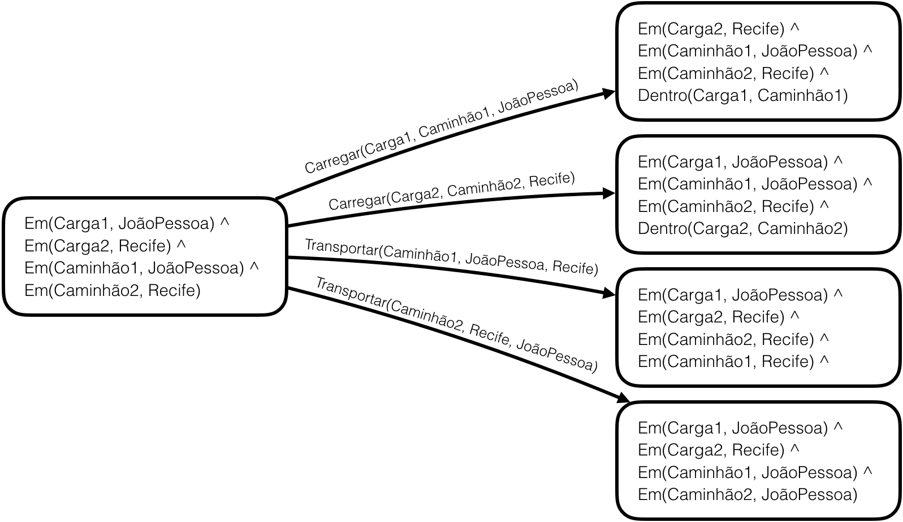
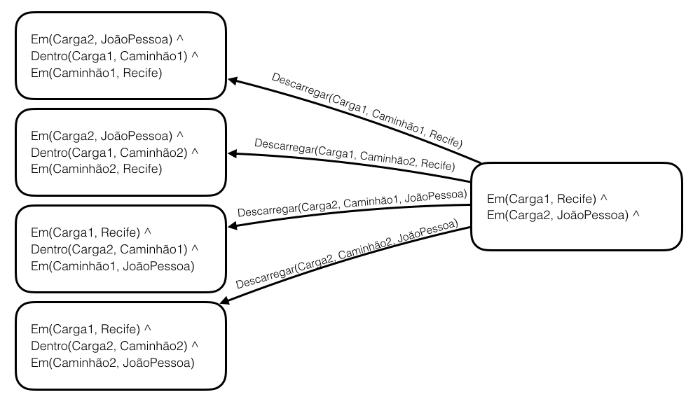
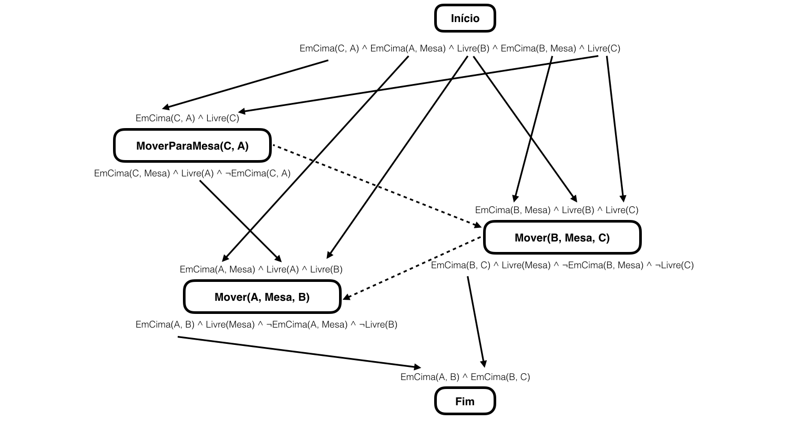

% Notas de Aula - Inteligência Artificial
% Yuri Malheiros
% UFPB - Campus IV - Rio Tinto

# Planejamento clássico

## 1. Introdução

Planejamento é o processo de elaboração de um plano, isto é, uma sequecência de
passos para alcançar um objetivo. Esta definição nos leva a pensar que
planejamento é o mesmo que busca na resolução de problemas. De fato, as duas
abordagens são semelhantes, inclusive é possível usar buscas para resolver
problemas de planejamento, porém elas possuem uma diferença crucial.
Na busca, um estado é uma representação atômica, por exemplo, uma cidade, uma
posição num tabuleiro, etc. Já no planejamento, um estado é uma coleção de
propriedades.

No planejamento clássico, o agente deve estar inserido num ambiente totalmente
observável, determinístico e estático.

## 2. STRIPS

STRIPS (STanford Research Institute Problem Solver) é um planejador automático
desenvolvido em 1971 por Richard Fikes e Nils Nilsson. STRIPS também é comumente
usado para referenciar a linguagem utilizada no planejador, assim, nas próximas
vezes que o nome STRIPS for mencionado estaremos referenciando a linguagem, não
o planejador.

Em STRIPS, um estado é representado por uma conjunção de fluentes (constantes ou
predicados). Por exemplo:

- Leve ^ Resistente
- Em(Pacote1, JoãoPessoa) ^ Em(Pacote2, CampinaGrande)

As definições levam em consideração a suposição de mundo fechado, isto é, os
fluentes que não aparecerem num estado são falsos. Com isso, não é necessário
negar de forma explícita constantes nem predicados.

As ações são definidas em três partes: assinatura, pré-condição e efeito.
Por exemplo, a seguir temos uma ação que representa ir de um lugar para outro.

~~~~{.email}
Ir(de, para)
Pré-condição: Em(de)
Efeito: ¬Em(de) ^ Em(para)
~~~~

A primeira linha é a assinatura `Ir(de, para)`, a segunda é a pré-condição e
a terceira é o efeito da ação.
As variáveis `de` e `para` recebem constantes para que a ação seja executada.
Por exemplo, `Ir(JoãoPessoa, CampinaGrande)`.

Para executar uma ação num estado $s$, a pré-condição da ação precisa ser satisfeita por
$s$. O resultado $s'$ será $s - Del(a) \cup Add(a)$. Onde, $Del(a)$ é a lista de
fluentes negados e $Add(a)$ a lista de fluentes positivos (não negados). No
exemplo *Ir(JoãoPessoa, CampinaGrande)*, a pré-condição *Em(JoãoPessoa)* precisa
ser satisfeita no estado atual, e, após sua execução, o estado será o estado atual
menos *Em(JoãoPessoa)* e unido com *Em(CampinaGrande)*.

## 3. Definindo um problema

Um problema de planejamento consiste de um estado inicial, um objetivo e
um conjunto de ações que podem ser executadas. O estado inicial é um estado
como qualquer outro, já o objetivo, além dos fluentes positivos, também
pode ter fluentes negados para garantir que um estado seja falso, e pode conter
variáveis, para quando não importar qual a constante num predicado.
Uma solução para um problema é uma sequência de ações a partir do estado inicial
que, ao serem realizadas, termina em um estado que satisfaz o objetivo.

O planejamento clássico se baseia na ideia de que a maioria das coisas num mundo
não são alteradas pelas ações, ou seja, que as ações tem efeitos pontuais.
Assim, os estados e ações devem ser descritos de forma concisa, mencionando
apenas o que for estritamente importante para eles.

A seguir veremos um exemplo de um problema de planejamento utilizando STRIPS.

### 3.1. Exemplo: transporte de carga

Vamos definir um problema de transporte de cargas entre as cidades de João
Pessoa e Recife. O estado inicial do problema é:

~~~{.email}
Estado inicial:
Em(Carga1, JoãoPessoa) ^ Em(Carga2, Recife) ^ Em(Caminhão1, JoãoPessoa) ^
Em(Caminhão2, Recife)
~~~

No estado inicial, temos uma Carga1 na cidade de João Pessoa e uma Carga2 na
cidade do Recife. Isto é expressado pelo predicado `Em(x, y)`, que significa
que um objeto x está num lugar y.

O objetivo do problema é:

~~~{.email}
Objetivo:
Em(Carga1, Recife) ^ Em(Carga2, JoãoPessoa)
~~~

No objetivo, queremos que a `Carga1` que estava em João Pessoa esteja no Recife e
que a `Carga2` que estava no Recife esteja em João Pessoa. Note que não foi
especificado nada sobre os caminhões, então não importa para a solução do
problema onde estarão os caminhões.

A primeira ação disponível é a ação Carregar:

~~~{.email}
Carregar(c, cam, l)
Pré-condição: Em(c, l) ^ Em(cam, l) ^ Carga(c) ^ Caminhão(cam) ^ Lugar(l)
Efeito: ¬Em(c, l) ^ Dentro(c, cam)
~~~

Ela tem como variáveis `c`, `cam` e `l`, a primeira precisa ser uma carga, a segunda
um caminhão e a terceira um lugar. Além disso, foi utilizado o predicado
`Dentro(x, y)`, que significa que um objeto x está dentro de um caminhão y.

A segunda ação é Descarregar:

~~~{.email}
Descarregar(c, cam, l)
Pré-condição: Dentro(c, cam) ^ Em(cam, l) ^ Carga(c) ^ Caminhão(cam) ^
              Lugar(l)
Efeito: Em(c, l) ^ ¬Dentro(c, cam)
~~~

Nessa ação, uma carga `c` que está dentro de um caminhão `cam` é retirada e deixada
na cidade `c`.

Por fim, temos a ação Transportar:

~~~{.email}
Transportar(cam, de, para)
Pré-condição: Em(cam, de) ^ Caminhão(cam) ^ Lugar(de) ^ Lugar(para)
Efeito: ¬Em(cam, de) ^ Em(cam, para)
~~~

Ela tem um caminhão e dois lugares como variáveis. No seu efeito, o caminhão
especificado sai do lugar `de` e vai para o lugar `para`.

A sequência de passos a seguir soluciona o problem, saindo do estado inicial
até chegar no objetivo:

- Carregar(Carga1, Caminhão1, JoãoPessoa)
- Transportar(Caminhão1, JoãoPessoa, Recife)
- Descarregar(Carga1, Caminhão1, Recife)
- Carregar(Carga2, Caminhão2, Recife)
- Transportar(Caminhão2, Recife, JoãoPessoa)
- Descarregar(Carga2, Caminhão2, JoãoPessoa)

Vamos ver passo a passo o resultado da aplicação de cada uma das ações:

~~~{.email}
Estado inicial:
Em(Carga1, JoãoPessoa) ^ Em(Carga2, Recife) ^ Em(Caminhão1, JoãoPessoa) ^
Em(Caminhão2, Recife)
~~~

~~~{.email}
Aplicando Carregar(Carga1, Caminhão1, JoãoPessoa)

Pré-condição:
Em(Carga1, JoãoPessoa) ^ Em(Caminhão1, JoãoPessoa) ^ Carga(Carga1) ^
Caminhão(Caminhão1) ^ Lugar(JoãoPessoa)

Efeito:
¬Em(Carga1, JoãoPessoa) ^ Dentro(Carga1, Caminhão1)

Estado após aplicar a ação:
Em(Carga2, Recife) ^ Em(Caminhão1, JoãoPessoa) ^
Em(Caminhão2, Recife) ^ Dentro(Carga1, Caminhão1)
~~~

~~~{.email}
Aplicando Transportar(Caminhão1, JoãoPessoa, Recife)

Pré-condição:
Em(Caminhão1, JoãoPessoa) ^ Caminhão(Caminhão1) ^ Lugar(JoãoPessoa) ^
Lugar(Recife)

Efeito:
¬Em(Caminhão1, JoãoPessoa) ^ Em(Caminhão1, Recife)

Estado após aplicar a ação:
Em(Carga2, Recife) ^ Em(Caminhão2, Recife) ^ Dentro(Carga1, Caminhão1) ^
Em(Caminhão1, Recife)
~~~

~~~{.email}
Aplicando Descarregar(Carga1, Caminhão1, Recife)

Pré-condição:
Dentro(Carga1, Caminhão1) ^ Em(Caminhão1, Recife) ^ Carga(Carga1) ^
Caminhão(Caminhão1) ^ Lugar(Recife)

Efeito:
Em(Carga1, Recife) ^ ¬Dentro(Carga1, Caminhão1)

Estado após aplicar a ação:
Em(Carga2, Recife) ^ Em(Caminhão2, Recife) ^ Em(Caminhão1, Recife) ^
Em(Carga1, Recife)

~~~

~~~{.email}
Aplicando Carregar(Carga2, Caminhão2, Recife)

Pré-condição:
Em(Carga2, Recife) ^ Em(Caminhão2, Recife) ^ Carga(Carga2) ^
Caminhão(Caminhão2) ^ Lugar(Recife)

Efeito:
¬Em(Carga2, Recife) ^ Dentro(Carga2, Caminhão2)

Estado após aplicar a ação:
Em(Caminhão2, Recife) ^ Em(Caminhão1, Recife) ^ Em(Carga1, Recife) ^
Dentro(Carga2, Caminhão2)
~~~

~~~{.email}
Aplicando Transportar(Caminhão2, Recife, JoãoPessoa)

Pré-condição:
Em(Caminhão2, Recife) ^ Caminhão(Caminhão2) ^ Lugar(Recife) ^
Lugar(JoãoPessoa)

Efeito:
¬Em(Caminhão2, Recife) ^ Em(Caminhão2, JoãoPessoa)

Estado após aplicar a ação:
Em(Caminhão1, Recife) ^ Em(Carga1, Recife) ^ Dentro(Carga2, Caminhão2) ^
Em(Caminhão2, JoãoPessoa)
~~~

~~~{.email}
Aplicando Descarregar(Carga2, Caminhão2, JoãoPessoa)

Pré-condição:
Dentro(Carga2, Caminhão2) ^ Em(Caminhão2, JoãoPessoa) ^ Carga(Carga2) ^
Caminhão(Caminhão2) ^ Lugar(JoãoPessoa)

Efeito:
Em(Carga2, JoãoPessoa) ^ ¬Dentro(Carga2, Caminhão2)

Estado após aplicar a ação:
Em(Caminhão1, Recife) ^ Em(Carga1, Recife) ^ Em(Caminhão2, JoãoPessoa) ^
Em(Carga2, JoãoPessoa)
~~~

Para verificar se o problema foi resolvido, precisamos checar se o estado
final satisfaz o objetivo. O objetivo é `Em(Carga1, Recife) ^
Em(Carga2, JoãoPessoa)`. Ambos os fluentes aparecem no estado final e não existe
nada que contradiga eles. Dessa forma, o objetivo foi alcançado.

## 4. Busca

É possível resolver um problema de planejamento utilizando algoritmos de busca
conhecidos, como busca em largura ou busca A*. Entretanto, além da busca comum
do estado inicial para o objetivo (progressão), no planejamento também é
utilizada a busca que parte do objetivo e vai até o estado inicial (regressão).

### 4.1. Progressão

A progressão geralmente é um forma ineficiente de busca para problemas de planejamento,
que costumam ter um número de estados muito grande. Como a maioria dos algoritmos
de busca tem complexidade exponencial, muitos problemas seriam inviáveis, a não
ser que uma boa heurística melhore o desempenho do algoritmo. Por exemplo,
um agente que tem como tarefa comprar um livro através do seu ISBN. Os ISBNs
têm 10 digitos, então, para esse caso, temos 10 bilhões possíveis ações para o
agente.

Os passos para aplicar a progressão são:

1. Iniciar o estado atual com o estado inicial;
2. Encontrar todas as ações que tem suas pré-condições satisfeitas pelo estado
atual;
3. Aplicar os efeitos das ações no estado atual para gerar os estados sucessores;
4. Verifique se algum dos estados sucessores satisfazem o objetivo;
5. Para cada novo estado repita 2, 3 e 4.

A Figura 1 mostra o estado inicial do exemplo de transporte de cargas e os
primeiros sucessores gerados a partir do estado inicial. As arestas que ligam
os nós representam as ações.

### 4.2. Regressão

A regressão é uma busca invertida, ela começa do objetivo e vai até o estado
inicial. Esse tipo de busca é facilitada pela natureza de uma linguagem como
STRIPS. Dado um estado $s$ e uma ação $a$, a regressão $s'$ de $s$ através de $a$
pode ser obtida da seguinte forma: $s' = (s - fluentesPositivosDoEfeito(a)) \cup préCondição(a)$

Tendo isto, o próximo passo é saber quais as ações podemos usar para regredir
de um estado para outro. Tais ações são chamadas de ações relevantes.
Pelo menos um efeito da ação relevante deve fazer parte do estado que está
sendo regredido. Adicionalmente, uma ação relevante não deve ter no seu efeito
um fluente que negue um fluente do estado sendo regredido.

Os passos para aplicar a regressão são:

1. O estado atual é o objetivo;
2. Encontrar todas as ações relevantes no estado atual;
3. Gerar estados antecessores regredindo o estado atual através das ações
relevantes;
4. Verifique se algum dos estados antecessores satisfazem o estado inicial;
5. Para cada novo estado repita 2, 3 e 4.

A Figura 2 mostra o objetivo do exemplo de transporte de cargas e os
primeiros atecessores gerados a partir da regressão do objetivo. As arestas que ligam
os nós representam as ações.

A regressão costuma ser mais eficiente que a progressão, já que é bem mais comum
que o número de ações relevantes na regressão seja menor que os possíveis estados
da progressão. Assim, o fator de ramificação da regressão tende a ser menor que
o da progressão.

### 4.3. Heurísticas

Para utilizar algoritmos de busca mais eficientes com o A*, é necessário definir
uma função heurística que estime o custo de um estado até o objetivo. Além
disso, a heurística precisa ser admissível, isto é, ela não pode superestimar
o custo real. No planejamento é possível encontrar heurísticas de forma
automática através de um problema relaxado, que é um problema com uma solução
mais fácil. Então, o custo para solução desse problema mais fácil passa a ser
a heurística do problema original.

Uma forma de relaxar um problema é adicionar mais
arestas ao grafo, ou seja, tornar possível utilizar mais ações num determinado
estado. Isto pode ser obtido ignorando as pré-condições das ações, fazendo com
que toda ação seja aplicável num estado. Outra forma é ignorar os fluentes
com negação, isto faz com que uma ação nunca desfaça o progresso
de outra, tornando o problema mais fácil de resolver.

Apesar do problema ficar mais fácil com o acréscimo de arestas, ele também
fica ainda mais caro computacionalmente, pois tem-se mais ações para serem
aplicadas em cada estado.  

## 5. Planejamento de ordem parcial

Durante uma busca, a progressão e a regressão exploram apenas sequências
ordenadas de ações que conectam o estado inicial ao objetivo. Este tipo
de plano é conhecido como plano totalmente ordenado.

O planejamento de ordem parcial (POP) decompõe o problema em subproblemas e pode
trabalhar neles de forma independente. Assim, cada solução para os subproblemas
é combinada para formar uma solução final.

Esse tipo de planejamento, pode ser implementado como uma busca num espaço de
planos, ao invés de uma busca num espaço de estados. A busca começa com um plano
vazio que é refinado até chegar ao plano final. As ações nessa busca não são
as ações do problema, mas ações que afetam o plano, ou seja, temos ações
para adicionar passos no plano, impor uma ordem entre duas ações, etc.

Todo POP começa com um ação Início e termina com uma ação Fim. A ação Início
não possui pré-condições e seu efeito é igual ao estado inicial do problema. A
ação Fim tem a pré-condição igual ao objetivo do problema e seu efeito é vazio.

Um plano é representado pelos seguintes componentes:

- Um conjunto de ações. Formam o conjunto de passos do plano. Elas são ações do
problema de planejamento, elas não são as ações da busca no espaço de planos.
- Links causuais. Eles ligam o efeito de uma ação a pré-condição de outra ação.
- Restrições de ordem. Define que uma ação deve vir antes ou depois de outra.
$A \prec B$ significa que A deve ser executado antes de B.
- Condições abertas. São pré-condições de algum passo que ainda não possui um
link. Uma pré-condição é satisfeita quando ela é efeito de um passo anterior.

A busca começa com um plano incompleto que consiste apenas da ação Início e da
ação Fim, onde $Início \prec Fim$. A próxima etapa da busca é escolher uma
condição aberta e gerar novos planos que satisfaçam tal condição. Nesse caso,
diferentes ações podem satisfazer uma mesma condição aberta, assim, é importante
gerar um plano diferente para cada possibilidade.

Ao gerar um novo plano, a busca precisa garantir a consistência do plano, ou
seja, que não existam ciclos nem conflitos entre os links casuais. Para isso, se
um link de A para B for adicionado ao plano, também deve ser adicionada a
restrição $A \prec B$.
Adicionalmente, ao acrescentar um link, todos os conflitos entre ele e as ações já
existentes devem ser resolvidos, e, se a ação A for nova no plano, também
é necessário resolver o conflito entre ela e todos os links existentes.
Os conflitos são resolvidos através de restrições de ordem, por exemplo, se
um link entre A e B causar um conflito com uma ação C, então uma restrição de
ordem precisa ser adicionada para fazer C acontecer antes de A ($C \prec A$) ou
depois de B ($B \prec C$).

Para verificar se o problema já foi resolvido, deve-se efetuar um teste
em cada novo plano gerado. O teste consiste em checar se o plano é consistente e
não possui condições abertas. Se tais requisitos forem verdadeiros, então ele é
uma solução.

### 5.1. Exemplo

A seguir veremos um exemplo de planejamento de ordem parcial.
Usaremos um conhecido domínio chamado mundo dos blocos.
Nele temos uma mesa com um conjunto de blocos e um braço robô que pode manipular
esses blocos. Cada bloco pode estar ou em cima da mesa ou em cima de outro bloco.
O braço robô só pode mover um bloco se não existir nenhum outro bloco em cima
dele e o braço só consegue pegar um bloco de cada vez. Nesse domínio os blocos
são representados por letras A, B, C, etc. O seguintes predicados também
são importantes:

- EmCima(b, x): onde b é um bloco e x é um bloco ou a mesa;
- Livre(x): o topo de x está vazio e um bloco pode ser colocado em cima dele.

As ações disponíveis são:

~~~{.email}
Mover(b, x, y)
Pré-condição: EmCima(b, x) ^ Livre(b) ^ Livre(y)
Efeito: EmCima(b, y) ^ Livre(x) ^ ¬EmCima(b, x) ^ ¬Livre(y)

MoverParaMesa(b, x)
Pré-condição: EmCima(b, x) ^ Livre(b)
Efeito: EmCima(b, Mesa) ^ Livre(x) ^ ¬EmCima(b, x)
~~~

Para o nosso exemplo, o estado inicial e objetivo são:

~~~{.email}
Estado inicial:
EmCima(C, A) ^ EmCima(A, Mesa) ^ Livre(B) ^
EmCima(B, Mesa) ^ Livre(C)

Objetivo:
EmCima(A, B) ^ EmCima(B, C)
~~~

As proximas Figuras (3 até 10) trazem o passo a passo da construção
do plano para solucionar o problema. (Fique atento às legendas, elas trazem
a explicação detalhada de casa passo)

\  

## Referências

- Slides da disciplina: Planning and Search da University of Nottingham (aulas 9, 10 e 11). Alechina, N. URL: http://www.cs.nott.ac.uk/~psznza/G52PAS/
- Notas de aula da disciplina: Artificial Intelligence do NPTEL (aulas 23, 24 e 25). Sarkar, S. e Mitra P. URL: http://nptel.ac.in/courses/106105078/24
- Livro: Artificial Intelligence a Modern Approach (3a edição). Russel, S. e Norvig, P.
